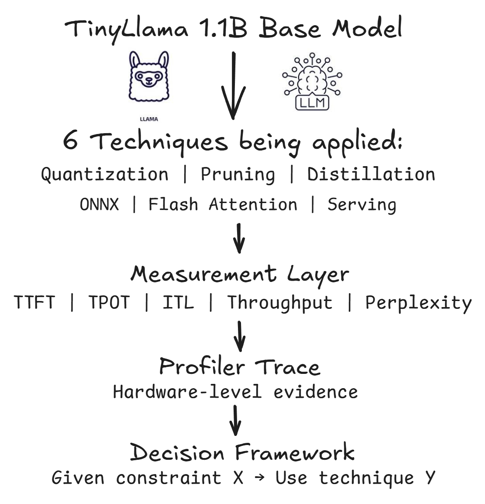

# LLM Inference Optimization Benchmark

> Benchmarking 10+ inference optimization techniques on TinyLlama 1.1B
> quantization, pruning, distillation, flash attention, onnx, and serving strategies
> on a GPU environment. Every result is backed by profiler traces and explained
> from hardware level, not just reported

**Author:** Adin Ramdan Farelino  
**Hardware:** GCP T4 GPU (16GB VRAM)    
**Model:** TinyLLama/TinyLlama-1.1B-Chat-v1.0  
**Status:** In Progress - actively running experiments  

## Motivation

Most LLM inference optimization tutorials stop at showing numbers.
This project started differently - from a question that kept coming back:

> *"Why is quantized inference sometimes slower than the baseline"*

The answer turned out to be a hardware story. Running an initial exploration on CPU revealed that optimization
techniques behave very differently depending on the hardware they run on. int4 quantization was **7x slowe** than float32
on CPU - not because of a bug, but because CPU has no native integer arithmetic. The model had to dequantize weights back to float32 before every computation, making the overhead larger than the memory saving

That exploration raised 7 questions that could not be answered on CPU alone. This project exists to answer all of them - on a GPU where these techniques were actually designed to run.

## Research Questions

This project is built around 7 questions that emerged from the CPU exploration and could not be answered without a proper GPU environment.

**Q1 - Does int4 quantization actually speed up inference on GPU?**
On CPU, int4 was 7x slower than float32 due to dequantization overhead. On GPU with Tensor Core native integer arithmetic, the expectation flips. This project measures whether that theoretical advantage holds in practice

**Q2 - Between GPTQ, AWQ, and NF4 - which int4 method wins on quality?**
GPTQ uses Hessian-based error compensation per column. AWQ protects salient weights before quantizing. NF4 uses normally distributed quantization points. All three target int4 but with fundamentally different approaches. Which one preserves perplexity best on TinyLlama?

**Q3 - Does Flash Attention actually flatten ITL at long sequences?**
Standard attention has O(n*n) memory complexity - every token attends to every other token, and intermediate results must pass through HBM repeatedly. Flash Attention tiles the computation to stay in SRAM. This project measures whether ITL stays flat from token 1 to token 1000, or starts degrading.

**Q4 - At which token position does KV cache pressure become visible?**
KV cache grows every generated token. At same point, the cache size starts pressuring GPU memory and ITL begins to rise. This project maps the inflection point by measuring ITL per token position across 1000 tokens.

**Q5 - What is the optimal batch size for throughput on a T4?**  
Batch size 1 underutilizes GPU parallelism. Too large a batch causes
memory pressure. There is a sweet spot where throughput peaks before
latency per request becomes unacceptable. This project finds that point
across batch sizes 1, 2, 4, 8, 16, and 32.

**Q6 - Does prompt length affect TTFT in a way consistent with O(n²) complexity?**  
Prefill — processing the input prompt before generating the first token —
is quadratic in sequence length for standard attention. This project measures
TTFT across prompt lengths 32 to 1024 tokens and tests whether Flash Attention
changes that scaling behavior.

**Q7 - With proper training, how much of the distillation quality gap closes?**  
The CPU exploration used only 50 training steps — student perplexity was 18,846
versus teacher perplexity of 7.87. That was underfitting, not a failure of
distillation. With 1000+ steps on WikiText, this project measures how close
the student can get while keeping its 35x speed advantage.

## Environment

| Component | Details |
|-----------|---------|
| Cloud | Google Cloud Platform |
| Instance | n1-standard-4 + NVIDIA T4 GPU |
| VRAM | 16GB GDDR6 |
| CUDA | 12.1 |
| Python | 3.10 |
| PyTorch | 2.1.0+cu121 |
| Transformers | 4.38.0 |
| Model | TinyLlama/TinyLlama-1.1B-Chat-v1.0 |
| Parameters | 1.1 Billion |
| Evaluation Dataset | WikiText-103 |

## Experiment Overview

Each experiment measures the same core metrics to ensure fair comparison.
Latency metrics are reported with p50, p90, and p99 percentiles -
not just averages — because production SLAs are defined at p99, not mean.

- **TTFT** — Time to First Token, how fast the model starts responding
- **TPOT** — Time Per Output Token, reported as mean, p50, p90, p99
- **ITL** — Inter-Token Latency per token position, up to 1000 tokens
- **Throughput** — tokens per second under sustained load
- **Perplexity** — quality on WikiText-103, not a single reference sentence

| Section | Techniques | Key Question |
|---------|------------|--------------|
| Quantization | float32, float16, int8, int4 NF4, GPTQ, AWQ | Does int4 beat float16 on GPU? |
| Pruning | Sparsity 10%, 30%, 50%, 70% | Where does quality collapse? |
| Distillation | Proper training 1000+ steps on WikiText | How close can student get? |
| Runtime | ONNX, TensorRT, torch.compile() | Which runtime wins on T4? |
| Flash Attention | FA on vs off × sequence length | Does ITL stay flat at 1000 tokens? |
| Serving | Batch size 1, 2, 4, 8, 16, 32 | What is the throughput sweet spot? |
| Context Length | Prompt 32 to 1024 tokens | Does TTFT scale quadratically? |
| KV Cache | Generate up to 1000 tokens | When does memory pressure hit? |
