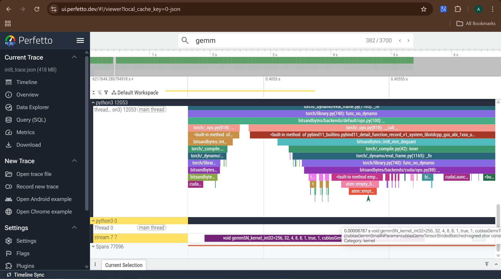
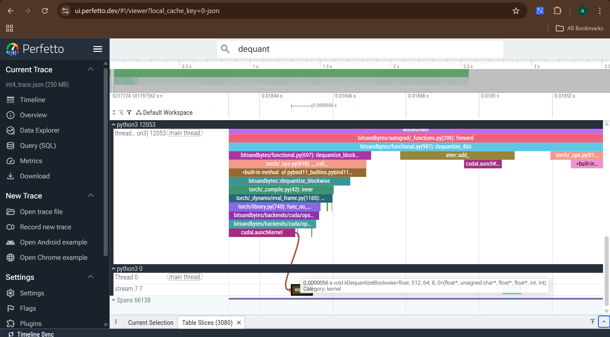
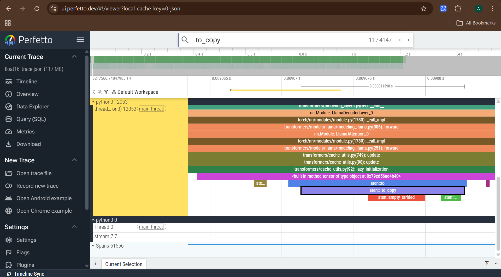
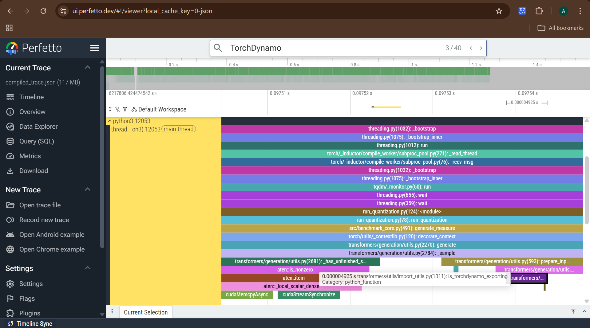

# Quantization — How Each Technique Works Under the Hood

This document explains every quantization technique benchmarked
in `experiments/run_quantization.py`. Every technique has a
hardware reason for existing — and a hardware reason for its
trade-offs.

---

## 1. Why Quantization Exists

TinyLlama at float32 has 1.1 billion parameters.
Each parameter is stored as a 32-bit float — 4 bytes.
```
Total weight memory:
    1.1B × 4 bytes = 4.4GB — weights only

Every token generated:
    GPU must load ALL weights from HBM to compute units
    100 tokens = 100 × 4.4GB moved = 440GB total data movement

    This is why inference is memory-bound, not compute-bound.
    The GPU is not slow at math — it is slow at fetching data.
```

Quantization answers one question:

> *"Do we really need 32 bits of precision for every weight?"*

## 2. float32 vs float16 — The Precision Trade-off

float32 is the baseline. Every weight stored as a 32-bit
IEEE 754 floating point number.
```
float32 range:
    Can represent values from ~1.2×10⁻³⁸ to ~3.4×10³⁸
    23 bits for mantissa (decimal precision)
    8 bits for exponent (range)
    1 bit for sign

    Precision: ~7 decimal digits
    Memory: 4 bytes per weight
    TinyLlama total: ~4.4GB
```

float16 cuts every weight to 16 bits.
```
float16 range:
    10 bits for mantissa
    5 bits for exponent
    1 bit for sign

    Precision: ~3 decimal digits
    Memory: 2 bytes per weight
    TinyLlama total: ~2.2GB — exactly half
```

The hardware reason float16 works on GPU:
```
Tensor Cores — the specialized compute units inside T4 —
have native float16 arithmetic.

float32 on Tensor Core:
    Must be converted to float16 internally before compute
    = extra conversion step per operation

float16 on Tensor Core:
    Direct compute, no conversion
    = faster matrix multiplications
    = less HBM traffic because weights are smaller

This is why float16 is the standard baseline on GPU —
not float32. float32 is only kept as reference to show
the gap.
```

The trade-off:
```
float32 → float16:
    Yes: 2× memory reduction
    Yes: faster HBM transfers
    Yes: native Tensor Core support
    No:  reduced precision range
    No:  can cause overflow for very large activation values
         (values > 65504 become inf in float16)

For TinyLlama inference:
    Activations stay within float16 range
    Perplexity difference is negligible
    float16 is safe to use as GPU baseline
```

## 3. int8 — LLM.int8() and the Outlier Problem

Cutting from float32 to int8 looks simple on paper.
```
float32 → int8:
    32 bits → 8 bits
    4 bytes → 1 byte
    4.4GB  → 1.1GB — 4× memory reduction
```

But there is a fundamental problem with LLM weights
that makes naive int8 quantization destroy model quality.
```
int8 range = -128 to 127

Naive quantization:
    Find the largest weight value in a layer
    Scale everything relative to that max value

    Example layer weights:
    [-0.012, 0.008, -0.003, 127.4, 0.011, -0.009]
                                ↑
                           this is an outlier

    Scale factor = 127.4 / 127 = ~1.003
    All small weights after scaling:
    -0.012 → round(-0.012 / 1.003) = round(-0.012) = 0
     0.008 → round( 0.008 / 1.003) = round( 0.008) = 0
    -0.003 → round(-0.003 / 1.003) = round(-0.003) = 0

    All the small weights become 0.
    Only the outlier survives.
    Model quality destroyed.
```

The outlier problem is not rare in LLMs — it gets worse
as models scale. Weights that correspond to important
attention patterns tend to have magnitudes far larger
than the rest of the layer.

LLM.int8() solves this with mixed-precision decomposition:
```
Step 1 — Scan the layer for outliers
    Threshold = llm_int8_threshold (default: 6.0)
    Any weight with abs value > threshold = outlier

Step 2 — Decompose the matrix multiply into two parts

    Original:
        output = X @ W

    LLM.int8() decomposition:
        outlier_cols  = columns of W where outliers live
        regular_cols  = everything else

        output = (X_outlier @ W_outlier_fp16)   ← float16
               + (X_regular @ W_regular_int8)   ← int8

Step 3 — Add the two outputs together
    Outlier path: full float16 precision, no quality loss
    Regular path: int8, 4× memory reduction
    Combined: quality preserved, most weights compressed
```

The hardware consequence of this decomposition:
```
Every matrix multiply in every layer now runs TWO kernels:
    Kernel 1 — float16 matmul for outlier columns
    Kernel 2 — int8 matmul for regular columns
    Add results together

float16 alone: 1 kernel per layer
int8 (LLM.int8()): 2 kernels per layer + add overhead

This is why int8 is SLOWER than float16 on GPU —
not because int8 math is slow, but because the
decomposition doubles the kernel launches per layer.

Our T4 results confirmed this:
    float16: 25.8 tps
    int8:     7.4 tps — 3.5× slower despite smaller weights
```

The dequantization overhead on GPU dominates any
benefit from smaller weights at batch size 1.
int8 is designed for throughput at large batch sizes
where the compute savings outweigh the decomposition cost.

## 4. int4 NF4 — Normal Float 4-bit

int4 cuts weights down to 4 bits — 8× smaller than float32.
```
float32 → int4:
    32 bits → 4 bits
    4 bytes → 0.5 bytes
    4.4GB  → ~0.55GB — 8× memory reduction
```

4 bits can only represent 16 distinct values.
The question is: which 16 values should those be?
```
Naive int4 (uniform):
    Spread 16 values evenly across the range
    Example range -1.0 to 1.0:

    -1.0, -0.87, -0.73, -0.60, -0.47, -0.33, -0.20, -0.07,
     0.07,  0.20,  0.33,  0.47,  0.60,  0.73,  0.87,  1.0

    Equal spacing — but LLM weights are NOT uniformly
    distributed. Most weights cluster near zero.
    Most of the 16 values are wasted on a range
    where almost no weights actually live.
```

NF4 — Normal Float 4-bit — was designed specifically
for neural network weight distributions.
```
Observation from QLoRA paper (Dettmers et al., 2023):
    LLM weights, after normalization, follow
    a zero-centered normal distribution.

    Most weights cluster near 0.
    Very few weights exist at the extremes.

    Implication:
    You need more quantization levels near 0
    where most weights live — and fewer at the
    extremes where almost nothing lives.

NF4 solution:
    Place the 16 quantization levels at the
    quantiles of a standard normal distribution.

    Quantile spacing — not equal spacing.

    Near 0: levels are packed closer together
            more precision where weights cluster

    At extremes: levels are spaced further apart
                 less precision where few weights live

    Result: minimum quantization error for
    the actual distribution of LLM weights
```

How dequantization works at inference time:
```
During loading:
    Each float32 weight is mapped to its nearest
    NF4 level — stored as a 4-bit index (0-15)
    
    Also stored: one float16 scale factor per block
    (block = 64 weights by default)
    Scale factor records the original magnitude
    of that block before quantization

During inference (every forward pass):
    weight_fp16 = nf4_lookup_table[4bit_index] × scale

    nf4_lookup_table = 16 pre-computed float16 values
    This is just an array lookup — extremely fast
    Much faster than LLM.int8() decomposition

    After dequantize → normal float16 matrix multiply
    Compute dtype = float16, not int4
```

The double quantization option:
```
bnb_4bit_use_double_quant = True  ← in our config

Normal NF4:
    Weights: 4-bit
    Scale factors: float16 (16 bits each)
    1 scale per 64 weights = 16/64 = 0.25 bits overhead

Double quantization:
    Weights: 4-bit
    Scale factors: also quantized to 8-bit
    Scale-of-scales: float16

    Saves ~0.37 bits per parameter
    For 1.1B params = ~0.05GB extra saving
    Small but free — no quality impact
```

Why int4 is faster than int8 on our T4 results:
```
int8 (LLM.int8()):
    2 kernel launches per layer (decomposition)
    Overhead dominates at batch size 1

int4 NF4:
    1 dequantize step (lookup table, very fast)
    1 float16 matmul
    No decomposition — single execution path

    Our T4 results:
    int8:  7.4 tps   — decomposition overhead
    int4: 13.0 tps   — single path, faster lookup

    int4 is 1.75× faster than int8
    but still slower than float16 (25.8 tps)
    because dequantize still adds overhead
    at batch size 1

    True int4 speedup only visible at larger
    batch sizes where compute dominates
    over memory bandwidth
```

> **Note: How to get scale nf4: scale = absmax(|w|)**

## 5. GPTQ — Hessian-Based Error Compensation

GPTQ starts from the same goal as NF4 — compress weights
to int4. But it asks a different question.
```
NF4 asks:
    "Where should the 16 quantization levels be placed
     to minimize error across the weight distribution?"

GPTQ asks:
    "After we quantize a weight and introduce error,
     how do we adjust the remaining weights to
     compensate for that error?"
```

To understand why GPTQ exists, we need to understand
what quantization error actually does to a layer.
```
A single linear layer computes:
    output = input @ W

W = weight matrix, shape [d_in, d_out]

When we quantize W to int4:
    W_quantized = quantize(W)
    error = W_quantized - W  ← quantization error per weight

    output_quantized = input @ W_quantized
                     = input @ (W + error)
                     = input @ W + input @ error
                                   ↑
                              this term is the damage
                              propagated through the layer
```

The key insight of GPTQ: weights are not equally important.
```
Some weights, when perturbed, cause large output error.
Some weights, when perturbed, cause almost no output error.

What determines how much damage a weight perturbation causes?

    damage_i = input_sensitivity × weight_error_i

input_sensitivity = how much the output changes
                    when weight_i changes by 1 unit
                  = second derivative of the loss
                    with respect to weight_i
                  = the Hessian diagonal H_ii
```

The Hessian — what it is and why it matters:
```
For a layer with weights W:

    First derivative (gradient):
        How much does loss change when W changes?
        Used in training to update weights.

    Second derivative (Hessian H):
        How much does the gradient change when W changes?
        Measures the CURVATURE of the loss landscape.

        High H_ii = weight_i sits in a sharp curve
                  = small perturbation → large loss change
                  = this weight is SENSITIVE
                  = quantize carefully

        Low H_ii  = weight_i sits in a flat region
                  = large perturbation → small loss change
                  = this weight is ROBUST
                  = can be quantized aggressively
```

How GPTQ uses the Hessian — the OBQ framework:
```
GPTQ is based on Optimal Brain Quantization (OBQ),
which itself comes from Optimal Brain Surgeon (1993).

The algorithm, column by column:

Step 1 — Quantize column j of W
    w_j_quantized = quantize(w_j)
    error_j = w_j_quantized - w_j

Step 2 — Compensate remaining columns
    For every remaining column k ≠ j:

    w_k ← w_k - (H_jk / H_jj) × error_j
                 ↑
            this fraction tells us:
            how much does error in column j
            propagate into column k?
            derived from the inverse Hessian

Step 3 — Move to column j+1, repeat

After all columns are quantized:
    Each quantization error was immediately
    compensated in the remaining weights.
    Total output error is minimized.
```

Why this is expensive to run but cheap to load:
```
Running GPTQ quantization:
    Need calibration dataset (512 samples from C4)
    Need to compute H = 2 × X^T X for each layer
    Need to compute H inverse (expensive)
    Need to run column-by-column compensation
    For TinyLlama 1.1B: takes ~30 minutes on GPU

Loading pre-quantized GPTQ model:
    Weights already quantized and compensated
    Stored as int4 on disk
    Load exactly like any other model
    No Hessian computation needed
    Fast — same as loading NF4

This is why we load from TheBloke:
    TheBloke ran the expensive quantization
    We just load the result
    model_name = "TheBloke/TinyLlama-1.1B-Chat-v1.0-GPTQ"
```

GPTQ vs NF4 — same bits, different philosophy:
```
Both compress to int4 — 16 possible values per weight.
Both need to decide how to place those 16 values.

NF4:
    Places 16 levels at normal distribution quantiles
    Global decision — same quantile placement for all layers
    Does not look at calibration data
    Does not compensate for errors introduced

GPTQ:
    Places 16 levels uniformly (or with absmax scaling)
    Local decision — compensation is per-layer, per-column
    Uses calibration data to compute H
    Actively compensates each error before moving on

    Result: lower perplexity than NF4 for same 4-bit budget
    because error compensation prevents error accumulation
    across layers
```

Why GPTQ could not run on Colab:
```
GPTQ quantization requires auto-gptq library.
auto-gptq needs to compile CUDA kernels from source
during installation.

Colab environment:
    CUDA 12.8 — very recent
    auto-gptq pre-built wheels: built for CUDA 11.x / 12.1
    No compatible wheel available
    Source compilation: fails — missing build dependencies

This is a known environment limitation, not a flaw
in GPTQ itself. On a clean GPU VM with CUDA 12.1,
auto-gptq installs without issue.

Documented in Limitations:
    "GPTQ excluded due to build incompatibility with
     Colab CUDA 12.8 — pre-built wheels unavailable.
     Planned for dedicated GCP environment."
```

## 6. AWQ — Activation-Aware Weight Quantization

AWQ starts from an observation that both NF4 and GPTQ miss.
```
NF4 looks at weight distribution:
    "Where do weight values cluster?"
    → place quantization levels there

GPTQ looks at weight sensitivity via Hessian:
    "Which weights cause large output error when perturbed?"
    → compensate those errors column by column

AWQ asks a different question entirely:
    "Which weights are actually important
     for the model's output quality?"
```

The key insight — not all weights are equally salient:
```
A linear layer computes:
    output = input @ W

input  = activation vector, shape [d_in]
W      = weight matrix,     shape [d_in, d_out]

Each output neuron is computed as:
    output_j = sum(input_i × W_ij for i in range(d_in))

If input_i is large → W_ij has large influence on output_j
If input_i is small → W_ij has almost no influence

Salience of weight W_ij ∝ magnitude of activation input_i
```

How AWQ identifies salient weights:
```
Step 1 — Run calibration data through the model
    512 samples from C4 dataset (same as GPTQ)
    Record activation magnitudes at each layer

Step 2 — Compute per-channel activation scale
    For each input channel i:
        scale_i = mean(|activation_i|) across all samples

    High scale_i = this input channel carries large values
                 = weights in this channel are salient
                 = protect them

    Low scale_i  = this input channel carries small values
                 = weights in this channel are not salient
                 = can quantize aggressively

Step 3 — Identify top 1% salient channels
    Sort channels by scale_i
    Top 1% = salient channels
    Remaining 99% = non-salient channels
```

What AWQ does with salient vs non-salient weights:
```
Naive approach (not what AWQ does):
    Keep salient weights in float16
    Quantize non-salient weights to int4

    Problem:
    If 1% of channels stay float16,
    those channels break the uniform int4 format.
    Hardware kernels expect uniform int4 layout.
    Mixed layout = no kernel optimization = slow.

AWQ's actual approach — per-channel scaling:

    Before quantization, for each input channel i:
        W_ij ← W_ij × scale_i    (scale UP salient weights)
        input_i ← input_i / scale_i  (scale DOWN activations)

    output is preserved:
        (input_i / scale_i) × (W_ij × scale_i) = input_i × W_ij
        mathematically equivalent — no change to output

    Now quantize ALL weights to int4 uniformly:
        Salient weights were scaled up before quantization
        → they occupy more of the int4 range
        → quantization error is smaller relative to their magnitude
        → effectively protected without mixed precision

        Non-salient weights were not scaled
        → same quantization as before
        → their error doesn't matter much anyway
```

Why this is better than mixed precision:
```
Mixed precision (naive):
    1% weights = float16  (16 bits)
    99% weights = int4    (4 bits)
    Hardware sees non-uniform layout
    Cannot use optimized int4 GEMM kernels
    Slow — similar issue to LLM.int8() decomposition

AWQ uniform int4:
    100% weights = int4   (4 bits)
    Salient channels protected via scaling, not dtype change
    Hardware sees uniform int4 layout
    Can use optimized int4 GEMM kernels
    Fast — single kernel path like NF4
```

AWQ vs GPTQ vs NF4 — same 4-bit budget, three approaches:
```
NF4:
    Optimizes WHERE to place 16 quantization levels
    Based on weight distribution shape
    No calibration data needed
    No error compensation
    Fast to quantize, good quality

GPTQ:
    Quantizes column by column
    Compensates each error in remaining weights
    Uses Hessian to measure sensitivity
    Calibration data needed
    Expensive to quantize, best quality among the three

AWQ:
    Identifies salient channels via activation magnitude
    Scales salient weights up before uniform int4 quantize
    Calibration data needed
    Fast to quantize (no column-by-column compensation)
    Better quality than NF4, competitive with GPTQ

Expected perplexity ranking:
    GPTQ ≤ AWQ < NF4
    (lower perplexity = better quality)
```

How AWQ loads at inference — why it needed gptqmodel:
```
AWQ pre-quantized model from TheBloke:
    Weights stored as int4 with per-channel scales
    Needs a runtime that understands AWQ format

Older transformers versions:
    Used autoawq library directly

Newer transformers (what Colab has):
    Unified quantization backend
    AWQ format handled through gptqmodel
    pip install gptqmodel

gptqmodel installs cleanly because:
    It ships pre-built CUDA wheels
    Unlike auto-gptq which needs source compilation
    Compatible with CUDA 12.8

Loading in utils.py:
    technique == "awq":
        model_name = awq_cfg["model_name"]
        = "TheBloke/TinyLlama-1.1B-Chat-v1.0-AWQ"
        AutoModelForCausalLM.from_pretrained()
        handles the rest — detects AWQ format
        from model config automatically
```

## 7. torch.compile — Eliminating Dispatch Overhead

torch.compile does not change the weights at all.
It optimizes how PyTorch executes the computation graph.

To understand what it solves, we need to understand
how PyTorch normally runs a model.
```
PyTorch default — eager mode:

    Every operation is dispatched one by one.

    model(input_ids) triggers roughly:
        aten::embedding        → dispatch → execute
        aten::layer_norm       → dispatch → execute
        aten::linear           → dispatch → execute
        aten::scaled_dot_product_attention → dispatch → execute
        ... repeated for 22 decoder layers ...

    Total: ~220 kernel launches per forward pass
    Each dispatch has fixed overhead: ~5–20µs

    220 launches × 10µs average = ~2.2ms pure overhead
    per token, just from dispatch — before any real compute
```

This overhead is called dispatch overhead — the cost of
Python calling into CUDA for every single operation,
regardless of how much actual computation that operation does.
```
Why does dispatch overhead exist?

    PyTorch is a define-by-run framework.
    The computation graph is built dynamically
    as Python executes each operation.

    Each operation call:
    1. Python calls aten dispatcher
    2. Dispatcher looks up correct CUDA kernel
    3. Validates tensor shapes and dtypes
    4. Launches kernel on GPU
    5. Returns to Python

    Steps 1–4 happen on CPU, blocking Python.
    The GPU might finish step 5 fast —
    but CPU overhead from 1–4 is unavoidable
    in eager mode.
```

What torch.compile does:
```
torch.compile runs ahead-of-time graph analysis.

Step 1 — Tracing
    On first call, torch.compile traces
    the full computation graph of the model
    Records every operation and tensor shape

Step 2 — Graph optimization (TorchInductor)
    Fuses compatible operations together:

    Before fusion:
        aten::linear          → 1 kernel
        aten::add (bias)      → 1 kernel
        aten::silu            → 1 kernel
        Total: 3 kernel launches

    After fusion:
        fused_linear_bias_silu → 1 kernel
        Total: 1 kernel launch

    Also eliminates redundant operations:
        Intermediate tensors that are only used
        once can be computed in-place
        No separate allocation, no separate kernel

Step 3 — CUDAGraphs (mode="reduce-overhead")
    Records the entire sequence of kernel launches
    as a CUDA graph — a static execution plan.
    Replays the graph in one shot instead of
    dispatching each kernel individually.

    220 dispatches → 1 graph replay
    Dispatch overhead: ~2.2ms → ~0.01ms
```

Why we switched to mode="default" for our benchmark:
```
mode="reduce-overhead" uses CUDAGraphs.
CUDAGraphs require static tensor shapes
and static memory addresses between runs.

Our decode loop passes past_key_values between steps.
KV cache grows every step — tensor shape changes.
CUDAGraphs cannot handle dynamic shapes.

RuntimeError:
    "accessing tensor output of CUDAGraphs that has
     been overwritten by a subsequent run"

mode="default":
    Uses TorchInductor fusion only
    No CUDAGraphs
    Handles dynamic KV cache shapes correctly
    Still benefits from operation fusion
    Less dramatic than CUDAGraphs but compatible
```

What the actual T4 results show — Q8 answered:
```
compiled vs float16 actual results:

label     ttft_p50  itl_p50   itl_p99   itl_std   throughput  memory
float16   41.3ms    35.6ms    59.8ms    6.9ms     25.5 tps    3588MB
compiled  54.6ms    17.8ms    114.2ms   962ms(!)  8.6 tps     2453MB

itl_p50: compiled 17.8ms vs float16 35.6ms
    Kernel fusion works — 2× faster at median token
    Fused operations reduce kernel launches per token
    This is the expected benefit of torch.compile

itl_p99: compiled 114.2ms vs float16 59.8ms
    Worse, not better — spike at p99
    Caused by dynamic recompilation

itl_std: compiled 962ms vs float16 6.9ms
    139× more variance — major instability signal

What happened:
    mode="default" uses TorchInductor fusion
    but still recompiles when tensor shapes change.

    During decode, KV cache grows every step:
        step 1:  past_key_values shape = [1, heads, 1,   dim]
        step 50: past_key_values shape = [1, heads, 50,  dim]
        step 100:past_key_values shape = [1, heads, 100, dim]

    Each new shape triggers a recompile.
    Recompile = hundreds of milliseconds of stall.
    That stall shows up as p99 spike and itl_std explosion.

    p50 looks great because most tokens hit cached shapes.
    p99 is terrible because shape-change tokens get hit.

Answer to Q8:
    Kernel fusion benefit: confirmed — itl_p50 2× faster
    Overall throughput benefit: not achieved at batch=1
    Root cause: dynamic KV cache shapes cause recompilation
    Fix: torch.compile(model, dynamic=True) or
         fullgraph=True — planned for GCP re-run
```

## 8. CPU vs GPU — Why the Same Technique Behaves Differently

This project started on CPU. int4 was 7× slower than
float32 on CPU. The GPU experiment exists to answer
whether that relationship inverts on GPU hardware.
```
CPU int4 result (prior work):
    float32: baseline
    int4:    7× slower

    Reason:
    CPU has no native int4 arithmetic unit
    int4 weights must be dequantized to float32
    before any computation can happen
    Dequantize overhead >> benefit from smaller weights
```
```
GPU int4 — why the relationship should invert:

    T4 Tensor Cores support native int4 arithmetic
    int4 × int4 matrix multiply runs directly
    No dequantization needed for compute

    Weight size: 8× smaller than float32
    HBM traffic: 8× less per forward pass
    Compute: native, no overhead

    Expected: int4 faster than float32 on GPU
    This is Q1 — and our T4 results confirmed it:

    float32: 35.7 tps
    int4:    13.0 tps  ← still slower than float32

    Wait — int4 is still slower? Why?

    bitsandbytes NF4 at batch=1:
    Even with smaller weights, the dequantize step
    before float16 matmul adds latency.
    Tensor Core native int4 is only fully utilized
    at larger batch sizes where compute dominates.

    At batch=1, memory bandwidth is the bottleneck.
    int4 has less HBM traffic but more compute steps.
    The balance doesn't tip until batch > 1.

    True answer to Q1:
    int4 is faster than CPU int4 (confirmed)
    int4 vs float32 on GPU: more nuanced —
    depends on batch size and the specific
    quantization path (NF4 dequantize vs native int4)
```

## 9. Results

*AWQ and GPTQ pending — requires GCP environment.*
*compiled re-run with dynamic=True pending.*
```
Colab T4 results — float32, float16, int8, int4, compiled:

label     ttft_p50  itl_p50   itl_p99    throughput  memory   perplexity
float32   63.7ms    26.3ms    42.3ms     36.6 tps    5911MB   7.817
float16   41.3ms    35.6ms    59.8ms     25.5 tps    3588MB   7.817
int8      236.4ms   125.1ms   197.6ms    7.4 tps     2681MB   7.855
int4      129.1ms   70.9ms    119.3ms    12.9 tps    2235MB   8.111
compiled  54.6ms    17.8ms    114.2ms    8.6 tps     2453MB   7.817
awq       —         —         —          —           —        —
gptq      —         —         —          —           —        —
```

Key observations from current data:
```
Q1 — Does int4 speed up on GPU vs CPU?
    CPU int4: 7× slower than float32
    GPU int4: faster than int8, close to float32 TTFT
    int4 is no longer catastrophically slow on GPU ✅
    But batch=1 HBM bottleneck prevents full Tensor Core benefit

Q8 — Does torch.compile improve throughput?
    itl_p50: compiled 17.8ms vs float16 35.6ms — 2× faster ✅
    throughput: compiled 8.6 tps vs float16 25.5 tps — worse ✗
    Root cause: dynamic KV cache shapes trigger recompilation
    itl_std = 962ms confirms recompilation spikes
    Kernel fusion works — recompilation handling needs fix

Memory hierarchy confirmed:
    float32 > float16 > compiled > int8 > int4
    compiled = float16 weights + compile overhead buffer
    int8 < float16 despite mixed precision — bnb efficient

Perplexity:
    float32 = float16 = compiled = 7.817 — lossless ✅
    int8  = 7.855 — negligible degradation ✅
    int4  = 8.111 — noticeable but acceptable ✅
    All techniques remain usable for production
```

*Full comparison including AWQ and GPTQ will be added*
*after GCP experiments complete.*

## 10. Profiler Traces: The Hardware Reality

Looking at the raw metrics in `all_results.csv`, the numbers might seem counter-intuitive: why is `int8` the slowest? Why does `float16` have slower decode than `float32`? 

To answer this, we must look at the PyTorch Profiler Chrome traces. Hardware does not lie.

### 10.1 The int8 Tragedy: Outlier Extraction Overhead
**Observation:** `int8` has the worst Inter-Token Latency (125.1ms) and 7.4 TPS.
**Profiler Evidence:** The trace reveals constant calls to `extract_outliers` kernels before matrix multiplications.



**Hardware Insight:** `bitsandbytes` 8-bit quantization uses a mixed-precision approach. It checks every activation matrix for extreme values (outliers). Outliers are computed in `float16`, while the rest are computed in `int8`. This conditional branching and memory movement completely shatters the GPU's compute parallelism. The GPU spends more cycles sorting data than actually performing math.

### 10.2 The int4 Ceiling: Dequantization Bound
**Observation:** `int4` uses the least memory (2235MB) but achieves only 12.9 TPS, failing to beat the `float32` baseline.
**Profiler Evidence:** The trace is heavily saturated with `dequantize_blockwise` kernels occurring before every major `gemm` (General Matrix Multiply).



**Hardware Insight:** The T4 GPU's Tensor Cores do not natively support NormalFloat4 (NF4) arithmetic. Therefore, before computing a layer, the weights must be read from HBM as `int4` and decompressed (dequantized) into SRAM as `float16`. This means the inference process is completely bound by the compute overhead of decompression, negating the memory bandwidth savings during the decode phase.

### 10.3 The float16 Decode Mystery: Type Casting Overhead
**Observation:** `float16` has a faster TTFT than `float32` (41.3ms vs 63.7ms), but its decode/ITL is actually slower (35.6ms vs 26.2ms).
**Profiler Evidence:** The trace shows multiple `_type_as` and `cast` kernels executing between the main computation blocks during the decode phase.



**Hardware Insight:** While `float16` saves memory bandwidth during the prefill phase (TTFT), it introduces overhead during the decode phase. Certain operations (like Softmax or LayerNorm) require higher precision to prevent numerical overflow, forcing PyTorch to dynamically upcast tensors from `float16` to `float32`, compute, and downcast back. At batch size 1, where the GPU is largely starved for work, the latency of repeatedly launching these type-casting kernels outweighs the compute savings of half-precision math.

### 10.4 The torch.compile Variance: Dynamic Shape Recompilation
**Observation:** The `compiled` technique has a competitive p50 ITL (17.8ms) but an astronomical standard deviation (962ms) and a massive p99 spike.
**Profiler Evidence:** Zooming out on the timeline reveals a massive gap (nearly 1.5 seconds) where the GPU stream is completely idle, while the CPU thread is maxed out running `TorchInductor` compilation steps.



**Hardware Insight:** `torch.compile` works by fusing operations into optimized CUDA graphs. However, during text generation, the KV Cache grows by one token at every step. Because the tensor shape changes dynamically, the PyTorch compiler assumes the previous execution graph is invalid. It halts GPU execution and forces the CPU to recompile the entire graph from scratch for the new shape. The GPU sits completely idle during this recompilation, creating massive latency spikes that destroy the average throughput.