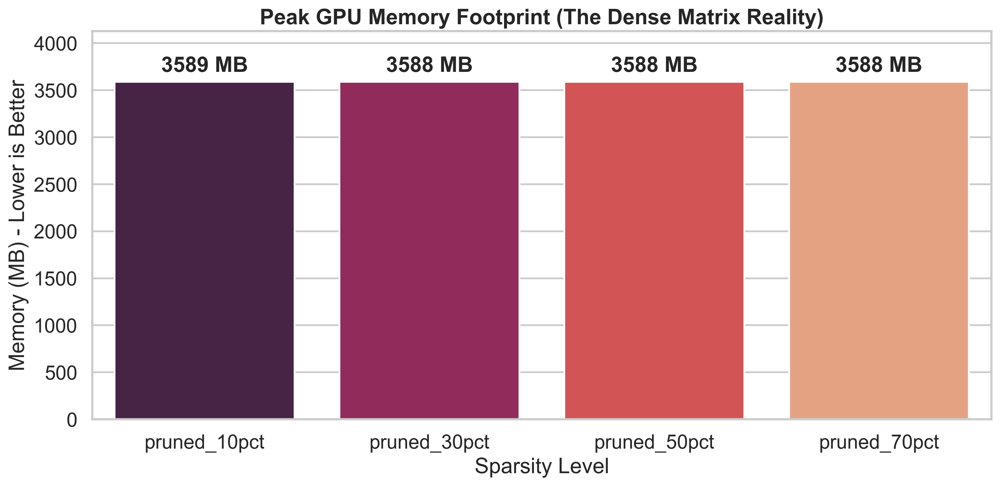
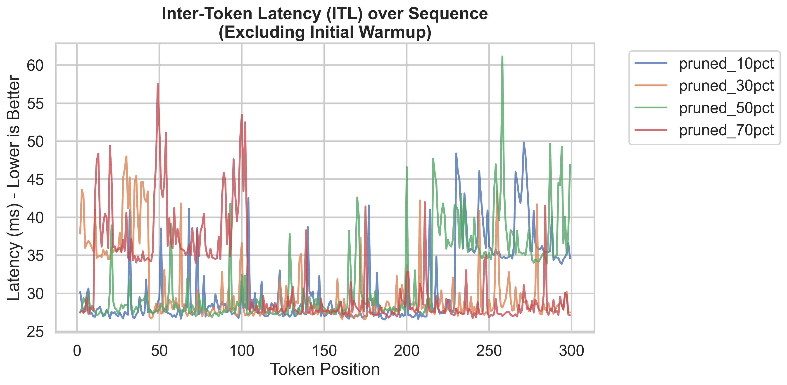
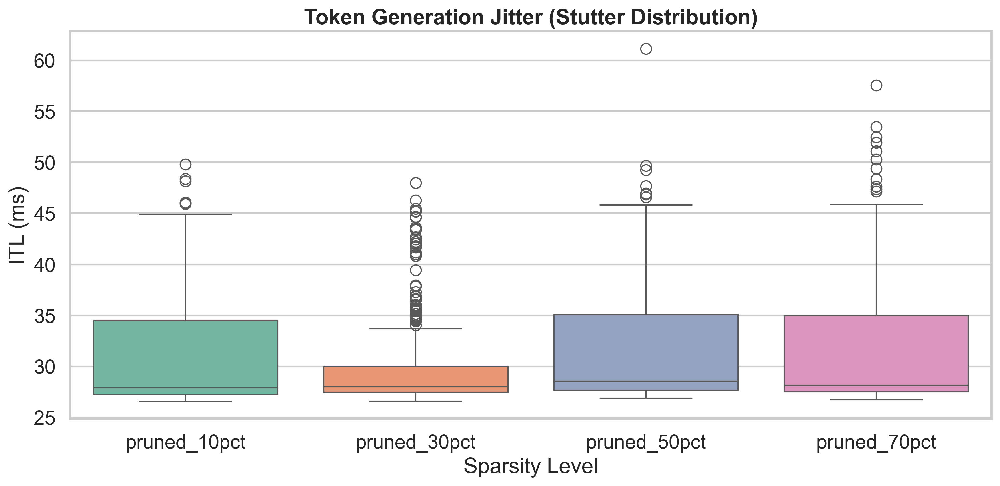

# Pruning — The Illusion of Unstructured Sparsity on Older Hardware

This document breaks down the results from `experiments/run_pruning.py`.
It explains what happens when we remove up to 70% of the attention weights 
in TinyLlama, and more importantly, why the hardware (NVIDIA T4) reacts 
the way it does.

---

## 1. The Theory: Cutting the Dead Weight

Neural networks are inherently over-parameterized. Not all weights contribute 
equally to the final output. Pruning is the process of identifying and removing 
the least important weights to make the model smaller and faster.

In this experiment, we used **Unstructured L1 Pruning**:
```
L1 Unstructured Pruning:
    1. Look at every weight in the matrix.
    2. Measure its L1 norm (absolute value).
    3. If the value is very close to 0, it means it has almost no
       Influence on the activation output
    4. Force that weight to exactly 0.0.
```

We targeted the attention projection layers (`q_proj`, `k_proj`, `v_proj`, `o_proj`) 
because they dominate the compute cycles during the decode phase. We tested 
four sparsity levels: 10%, 30%, 50%, and 70%.

The theoretical expectation:
> *"If a matrix is 50% zeros, it should take half the memory to store and half the time to multiply."*

The reality on our benchmark tells a completely different story.

## 2. The PyTorch Reality: Masking vs. Baking

Before looking at the hardware, we must understand how PyTorch implements pruning.
A naive call to `torch.nn.utils.prune` does **not** make the model faster. In fact, 
it makes inference significantly slower.

```
How PyTorch Prunes (Default Behavior):
Original weight is renamed to weight_orig.
A binary mask (weight_mask) is created.
During every forward pass, PyTorch computes:
weight = weight_orig * weight_mask
Then it performs the actual matrix multiplication:
output = input @ weight

Impact on Inference:
Instead of 1 matrix multiplication, the GPU now does 1 element-wise
multiplication AND 1 matrix multiplication per layer, per token.
This destroys throughput.
```

To measure true hardware performance, our `benchmark_core.py` forces the zeros 
permanently into the weights using `prune.remove()`. 
```python
# From src/utils.py
prune.l1_unstructured(module, name='weight', amount=sparsity_level)
prune.remove(module, 'weight') # Bakes the zeros, removes the dynamic mask
```

This ensures the GPU executes a standard Matrix Multiplication (GEMM) without
framework overhead.

## 3. The Hardware Reality: Dense vs. Sparse Compute
```
Here are the actual results from our T4 GPU:

label           throughput   memory   perplexity
float16 (base)  25.5 tps     3588MB   7.817
pruned_10pct    31.0 tps     3589MB   7.830
pruned_30pct    26.0 tps     3588MB   8.168
pruned_50pct    27.4 tps     3588MB   11.820
pruned_70pct    26.1 tps     3588MB   246.604
```

>**(Note: The 31.0 TPS at 10% is a standard Colab instance variance/warmup anomaly. The trend stabilizes at 30%+).**

### The VRAM Illusion



*Figure 1: Memory footprint across different sparsity levels. Notice the absolute lack of variance.*

**Observation:** Memory footprint is completely locked at ~3588 MB regardless of sparsity. 70% of the weights are zero, yet memory usage did not drop by a single megabyte.

**Hardware Insight:**   
PyTorch stores these matrices in a dense float16 format. To the hardware, 0.0 is just another 16-bit floating-point number. It takes up the exact same 2 bytes of VRAM as 3.1415. Because we used unstructured pruning, the zeros are scattered randomly. The memory allocator cannot compress the tensor.

### The Throughput Ceiling & Generation Stability

**Observation:** Throughput hovers around 26-27 TPS for 30%, 50%, and 70% sparsity. This is practically identical to the unpruned float16 baseline.

 
*Figure 2: Token generation latency over time (excluding initial compilation spikes).*

   
*Figure 3: Distribution of ITL showing jitter and outlier spikes (stutter) during generation.*

**Hardware Insight:**   
The NVIDIA T4 GPU uses the Turing architecture. Turing Tensor Cores are designed strictly for dense matrix multiplication. When the Tensor Core receives a matrix that is 50% zeros, it does not magically skip the calculations. It faithfully executes 0.0 * input = 0.0.
The GPU spends the exact same amount of clock cycles computing zeros as it does computing actual weights.

> **When does Pruning actually improve speed?**
> To get latency benefits from zeros, you need specialized hardware that can skip the computation physically at the silicon level. Newer architectures (like Ampere on the A100 or A10G) introduced Sparse Tensor Cores supporting **2:4 Structured Sparsity**.
```
2:4 Structured Sparsity (Ampere+):
    For every 4 values in a memory block, exactly 2 must be zero.
    The hardware physically compresses the matrix in memory by 50%.
    The Tensor Core multiplexer skips the zero-multiplications.
    Result: 2x speedup and 2x memory reduction.

Our Experiment (T4):
    Random (unstructured) zeros.
    No Sparse Tensor Cores.
    Result: 0x speedup, 0x memory reduction.
```

## 4. Quality Collapse: The Limits of the Network

Since we proved that unstructured pruning gives us no latency or memory benefits on T4, we evaluate it strictly on how it degrades model intelligence.
```
    1. 10% Sparsity (Perplexity 7.83):
       Almost identical to the 7.81 baseline. The model easily absorbs the loss of the bottom 10% of weights. These were truly "dead" connections.
    2. 30% Sparsity (Perplexity 8.16):
       Minor degradation. The model will start to lose nuance in complex reasoning, but standard generation remains coherent.
    3. 50% Sparsity (Perplexity 11.82):
       The breaking point. A perplexity jump of this magnitude indicates severe knowledge loss. The model will hallucinate frequently and struggle with grammar structure. We have pruned "load-bearing" weights.
    4. 70% Sparsity (Perplexity 246.60):
       Complete catastrophic collapse (lobotomy). The model is outputting absolute gibberish. The attention mechanism has been fundamentally destroyed.
```

## 5. Conclusion & Engineering Decision
 
> Should we use unstructured pruning on older GPUs like T4?

**Absolutely not.** Our benchmark proves that without hardware-level support for structured sparsity (Ampere architecture or newer), pruning only destroys model quality (Perplexity 7.8 → 11.8 at 50%) while providing zero benefits to inference speed or memory footprint.

For a T4 GPU, quantization (like NF4 or AWQ) remains the vastly superior optimization technique, as it physically reduces memory bandwidth bottlenecks — which is something the T4 actually cares about.