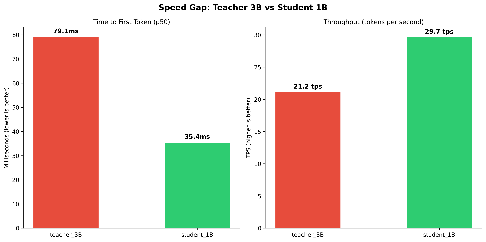
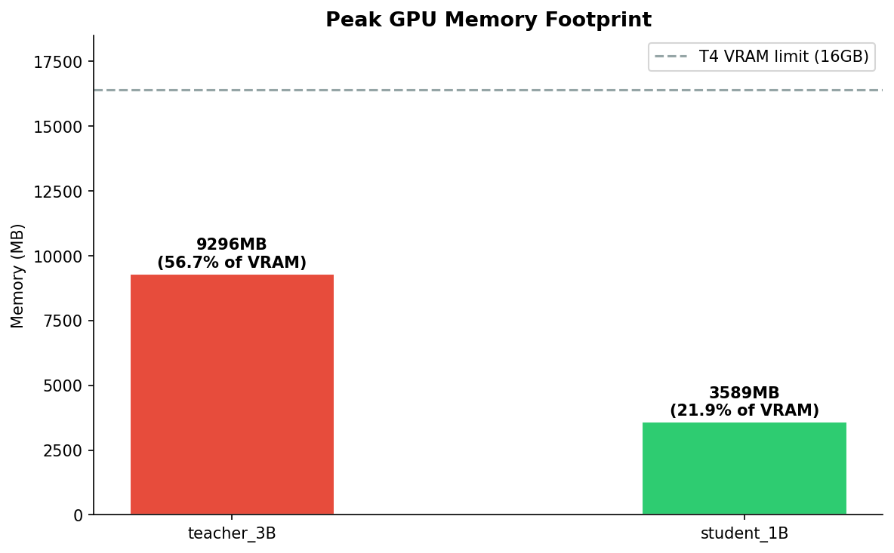
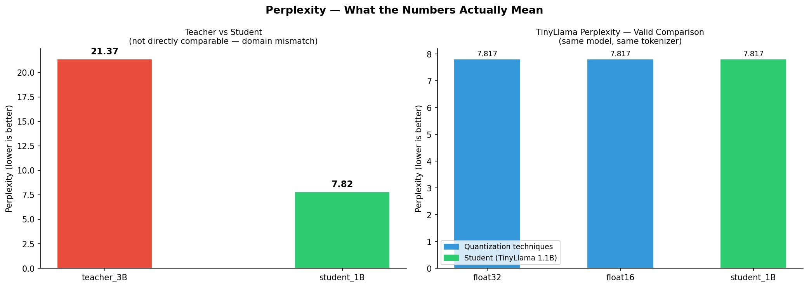
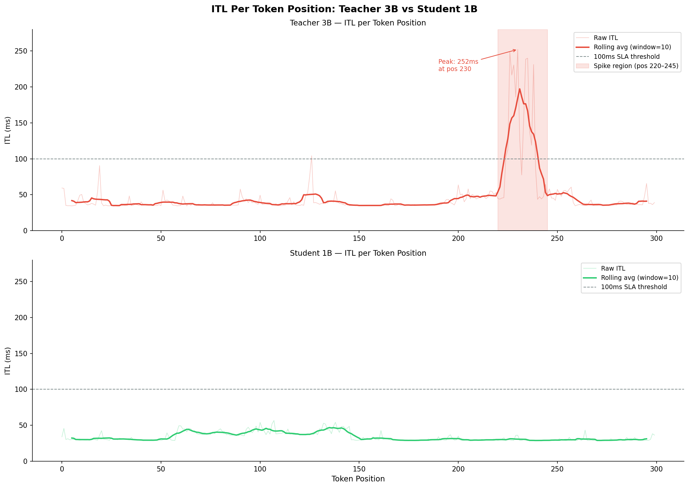

# Distillation — From Mechanics to Production Trade-offs

This document covers two things. First, the mechanics of Knowledge Distillation — what actually happens during training, why the loss function is designed the way it is, and what temperature does to the distribution. Second, the production benchmark — what happens when you take a pre-distilled student to a real GPU and measure the actual cost of choosing smaller.

---

## 1. Why Distillation Exists

Every other optimization in this project attacks the memory bandwidth problem from the inference side — quantization compresses weights at load time, pruning zeros out connections, Flash Attention reorganizes memory access patterns. All of them start with the full model and modify how it runs.

Distillation attacks the same problem before inference begins. Instead of modifying how a large model runs, it trains a smaller model to approximate the large model's behavior — so the smaller model is what gets deployed.
```
The memory bandwidth argument:

    OpenLLaMA 3B at float16:
        3B parameters × 2 bytes = 6GB weights
        Every token generated: GPU must load 6GB from HBM
        At T4 bandwidth ~300 GB/s: ~20ms pure data movement per token

    TinyLlama 1.1B at float16:
        1.1B parameters × 2 bytes = 2.2GB weights
        Every token generated: GPU must load 2.2GB from HBM
        At T4 bandwidth ~300 GB/s: ~7.3ms pure data movement per token

    Theoretical speed ratio from bandwidth alone: ~2.7x faster
```

But bandwidth is not the only factor. The student also has fewer layers, fewer attention heads, and a smaller hidden dimension — all of which reduce kernel launches per token, SRAM pressure per layer, and total compute cycles per forward pass. The full speed gap is larger than bandwidth ratio alone predicts. The benchmark in Section 4 measures where it actually lands on T4.

## 2. How Knowledge Distillation Works — Under the Hood

### The Core Problem: What Should the Student Learn?    
The naive approach is to train the student directly on ground truth labels — the same way the teacher was trained originally. This is called hard label training.
```
Hard label training:
    Input:  "Neural networks are inspired by"
    Target: "the"    ← one correct answer, confidence = 1.0

    Student sees: one right answer, everything else is wrong.
    Student learns: predict "the" in this context.
```

The problem is information loss. The teacher, after training, does not just know that "the" is correct — it has a full probability distribution over the entire vocabulary.
```
Teacher output distribution for "Neural networks are inspired by":
    "the"        → 0.71   ← most likely
    "a"          → 0.12   ← also reasonable
    "their"      → 0.08   ← plausible
    "biological" → 0.04   ← less likely but valid
    "human"      → 0.03
    ... (32,000 vocabulary entries total)

Hard label training discards all of this.
Student only sees: the = 1.0, everything else = 0.0
```

That distribution — the teacher's soft output — contains relational knowledge about which concepts are semantically similar. "a" and "the" are both determiners, so their probabilities are both elevated. "biological" and "human" are both valid continuations for a sentence about neural network inspiration. Hard labels throw all of that away.
This is the core insight behind Knowledge Distillation, first formalized by Hinton et al. (2015): soft labels carry more information per training example than hard labels do.

### The Loss Function   
The distillation loss combines two signals.
```
L_total = (alpha × L_hard) + (beta × L_soft)

L_hard = CrossEntropy(student_logits, ground_truth_labels)
         Standard next-token prediction loss.
         Keeps the student grounded in actual correct answers.

L_soft  = KL_Divergence(student_soft_probs, teacher_soft_probs) × T²
          Measures how different the student's probability distribution
          is from the teacher's.
          Pushes the student to match the teacher's uncertainty profile.
```

From the prototype in prototypes/kd_under_the_hood.py:
```python
hard_loss = F.cross_entropy(
    student_logits.view(-1, student_logits.size(-1)),
    labels.view(-1),
    ignore_index=-100
)

student_soft = F.log_softmax(student_logits / temperature, dim=-1)
teacher_soft = F.softmax(teacher_logits / temperature, dim=-1)

soft_loss = F.kl_div(
    student_soft, teacher_soft, reduction="batchmean"
) * (temperature ** 2)

total_loss = alpha * hard_loss + beta * soft_loss
```

Why KL Divergence and not MSE between logits:
```
MSE between logits:
    Treats each vocabulary entry as an independent regression target.
    Does not account for the fact that logits compete through softmax —
    raising one effectively lowers all others.
    Misses the relational structure between vocabulary entries.

KL Divergence:
    Measures the information lost when you use the student distribution
    to approximate the teacher distribution.
    Operates on probabilities after softmax — respects the competitive
    relationship between vocabulary entries.

KL(P || Q) = sum(P(x) × log(P(x) / Q(x)))

Where P = teacher distribution, Q = student distribution.
Zero when identical. Grows as they diverge.
```

### Temperature — What It Does to the Distribution  
Temperature T is the single most important hyperparameter in Knowledge Distillation. It controls how much of the teacher's uncertainty gets passed to the student.
```
Without temperature (T=1):
    Teacher output after softmax:
    "the"        → 0.9997
    "a"          → 0.0002
    "their"      → 0.0001
    everything else → ~0.000...

    Distribution is nearly one-hot.
    Soft labels carry almost no more information than hard labels.
    Student learns nothing from the relational structure.

With temperature (T=4, from config):
    student_soft = softmax(logits / 4)
    teacher_soft = softmax(logits / 4)

    "the"        → 0.71
    "a"          → 0.12
    "their"      → 0.08
    "biological" → 0.04

    Distribution is flatter — softer.
    Rare but plausible tokens have elevated probability.
    Semantic relationships between tokens are now visible.
    Student can learn that "a" and "the" are interchangeable here.
```

Why multiply soft loss by T²:
```
Dividing logits by T before softmax compresses gradient magnitudes —
gradients flowing back through soft_loss are smaller by 1/T²
compared to what they would be at T=1.

Multiplying by T² compensates for this compression, ensuring soft loss
contributes at the correct scale relative to hard loss regardless of T.

Without T² compensation:
    High temperature → very small gradients from soft loss
    hard loss dominates
    Distillation degrades to standard training — defeating the purpose

With T² compensation:
    Gradient scale is preserved
    alpha and beta control the actual balance between the two signals
```

### Teacher is Frozen - Why This Matters    
In the prototype, the teacher's parameters have requires_grad = False and the teacher runs under torch.no_grad().
```python
for param in teacher.parameters():
    param.requires_grad = False

with torch.no_grad():
    teacher_out = teacher(input_ids=x, attention_mask=mask)
```

This is not just a memory optimization — it is a conceptual requirement. The teacher is a fixed reference. If the teacher's weights were updated during training, the soft labels would shift every step — the student would be chasing a moving target, making convergence unstable or impossible.

The memory consequence on T4 is significant:
```
Teacher frozen:
    No gradient storage needed for teacher parameters
    No optimizer state for teacher
    Memory cost: weights only = ~2.2GB float16

If teacher were trainable:
    Gradient storage:          ~2.2GB extra
    Optimizer state (Adam):    ~4.4GB extra
    Total overhead:            ~6.6GB extra — exceeds T4 VRAM
```

### The CPU Prototype Result — Why It Was Underfitting      
The initial CPU exploration in `prototypes/kd_under_the_hood.py` trained for 50 steps on 4 dummy sentences. Student perplexity reached 18,846 against teacher perplexity of 7.87.

This was not a failure of distillation. It was a controlled demonstration of what underfitting looks like — and proof that the training mechanics work end to end.
```
CPU prototype constraints:
    Training data:        4 sentences (not WikiText)
    Steps:                50 (not 1000+)
    Student architecture: custom 4-layer GPT-2 config, random init
    Vocabulary:           inherited from TinyLlama tokenizer, ~32k tokens

    A randomly initialized model with 4 layers trained on 4 sentences
    for 50 steps will never reach good perplexity.
    The loss curve was still descending at step 50 —
    the model was learning, just not given enough time or data.

What that prototype proved:
    The KD training loop runs end to end without errors.
    Both hard loss and soft loss decrease across steps.
    Temperature scaling produces valid soft distributions.
    Teacher logits transfer meaningful signal to the student.

    The mechanics are correct. The scale was intentionally minimal.
```

## 3. Why This Project Uses Pre-Trained Models for the GPU Benchmark

Training a student from scratch on WikiText for 1000+ steps would answer a training research question. This project is an inference optimization benchmark — the question is what happens after training, on a real GPU, at serving time.

The decision to use pre-trained checkpoints reflects how distillation actually works in production:
```
Research workflow (what papers do):
    Define teacher and student architectures.
    Run distillation training on large dataset.
    Evaluate the trained student.
    Publish the checkpoint.

Production workflow (what engineers do):
    Download the published checkpoint.
    Benchmark it against the teacher on target hardware.
    Decide: is the speed gain worth the quality cost?
    Deploy or reject.
```

TinyLlama 1.1B is explicitly documented as having been trained using distillation techniques from larger LLaMA-family models. OpenLLaMA 3B is a well-established open reproduction of LLaMA at 3B parameters. Benchmarking these two answers the production question directly.

## 4. Production Benchmark Results  

This is the results what we get after we get results compare between Teacher Model 3B and Student Model 1B

### Summary Table

### Summary Table

| label | ttft_p50_ms | itl_p50_ms | itl_p99_ms | itl_std_ms | throughput_tps | peak_memory_mb | perplexity |
|------------|-------------|------------|------------|------------|----------------|----------------|------------|
| teacher_3B | 79.1 | 36.6 | 238.5 | 34.0 | 21.2 | 9295 | 21.4 |
| student_1B | 35.4 | 30.3 | 53.0 | 6.2 | 29.7 | 3589 | 7.8 |

> Teacher perplexity is not directly comparable to student.

### Speed Gap



Student is 2.23x faster at TTFT and 1.40x higher in throughput.

    teacher_3B:  TTFT p50 = 79.1ms,  throughput = 21.2 tps
    student_1B:  TTFT p50 = 35.4ms,  throughput = 29.7 tps

TTFT gap comes directly from the prefill phase — processing the input
prompt before generating the first token. Teacher has 3B parameters
across more layers and wider hidden dimensions, so the prefill forward
pass loads more data from HBM and runs more kernel launches before
the first token is produced. Student at 1.1B completes the same
prefill with significantly less data movement.

Throughput gap is smaller than TTFT gap because both models are
IO-bound at batch size 1. At batch size 1, neither model fully
utilizes GPU parallelism — both spend most of their time waiting
for weights to load from HBM rather than computing. The bandwidth
ratio between teacher and student is ~2.7x, but at batch size 1
the gap narrows because memory access patterns for both models
are similarly suboptimal.

At larger batch sizes, the throughput gap would widen. Teacher
weights cost more to amortize per batch — same IO cost, but the
fixed overhead per layer compounds across more parameters.

### Memory Gap



    teacher_3B:  9,295 MB  — 56.7% of T4 VRAM
    student_1B:  3,589 MB  — 21.9% of T4 VRAM

    Freed by choosing student: 5,706 MB (5.6 GB)

Teacher consumes more than half the T4's 16GB VRAM for weights alone.
This is before any KV cache allocation, before activation memory
during inference, and before any other process sharing the GPU.

The 5.6GB freed by choosing student is not just a smaller number —
it changes what is possible on the same hardware.

Production implications of 5.6GB freed:

    Larger KV cache:
        More freed VRAM → longer context before OOM
        Teacher at 9.3GB leaves ~6.7GB for KV cache
        Student at 3.6GB leaves ~12.4GB for KV cache
        Nearly 2x more context length before memory pressure

    Multiple model instances:
        At 9.3GB, only one teacher fits on T4 (16GB)
        At 3.6GB, four student instances fit on a single A100 (80GB)
        Direct impact on cost per request in multi-tenant serving

    Headroom for optimization:
        Student leaves room for larger batch sizes
        Teacher is already memory-constrained at batch size 1

### Perplexity



    teacher_3B:  21.4   domain mismatch — not valid for comparison
    student_1B:   7.8

Teacher perplexity of 21.4 is worse than student perplexity of 7.8.
This is not evidence that the student is a better language model.
It is evidence that perplexity is sensitive to training domain alignment.

OpenLLaMA 3B was trained on RedPajama — a large web crawl dataset.
TinyLlama 1.1B was trained on SlimPajama and Starcoderdata — a more
curated mixture that includes cleaner web text closer to WikiText-103's
style. Perplexity on WikiText-103 measures how well a model predicts
that specific domain of text. When training distributions differ,
perplexity scores across models are not comparable.

The valid quality comparison is TinyLlama against itself:

    float32 baseline:  7.817
    float16 baseline:  7.817
    student_1B:        7.817

    Difference: 0.000 — identical.

Student is TinyLlama 1.1B loaded in float16.
The perplexity matches float16 baseline exactly because
it is the same model weights, same tokenizer, same evaluation.
No quality was lost relative to the unoptimized baseline.

What this means for the distillation story:

    The quality gap between teacher and student cannot be measured
    by perplexity alone when training domains differ.

    What can be measured:
        Speed — student is 2.23x faster at TTFT
        Memory — student uses 2.6x less VRAM
        Stability — student p99 is 4.5x lower than teacher p99

    What requires a different evaluation:
        Task-specific benchmarks on the same held-out dataset
        Head-to-head generation quality comparison
        MMLU, HellaSwag, or domain-specific evaluation sets

    This is a known limitation of this experiment.
    The infrastructure to run task-specific evaluation
    requires the GCP environment planned for Phase 2.

### Production Decision Framework

The benchmark numbers translate directly into deployment decisions.

Choose student (TinyLlama 1.1B) when:

    Latency is the primary constraint
        TTFT 35ms vs 79ms — student wins for real-time applications
        Chat interfaces, interactive tools, streaming responses

    Memory is the primary constraint
        3.6GB vs 9.3GB — student enables multi-instance serving
        Cost-sensitive deployments, shared GPU infrastructure
        Long context applications where KV cache headroom matters

    Predictability matters more than peak quality
        itl_std 6.2ms vs 34.0ms — student is 5.5x more stable
        SLA-bound systems where p99 latency must stay under 100ms
        Student never breaches 100ms — teacher breaches it 23 times
        across 300 measured token positions

Choose teacher (OpenLLaMA 3B) when:

    Task complexity requires larger model capacity
        Complex reasoning, multi-step instruction following
        Tasks where 1.1B parameters demonstrably underperforms
        Requires task-specific evaluation to confirm, not perplexity alone

    Latency is not a hard constraint
        Batch processing pipelines where TTFT does not matter
        Offline inference where throughput > latency

    Memory is available
        GPU with >16GB VRAM where teacher fits without pressure
        Dedicated inference hardware, not shared infrastructure

The ITL per position data makes the stability argument concrete:

    Teacher breaches 100ms SLA at token positions:
        ~120-125: brief spike to 75-104ms
        ~220-270: sustained cluster, peak 252ms

    Student stays under 60ms across all 300 positions.
    No SLA breach. No spike cluster.

This is not just "student is faster" — it is "student is
predictable in a way that matters for production commitments."
A team that signs a 100ms p99 SLA can deploy student with
confidence. The same commitment with teacher would require
either padding the SLA or accepting occasional breaches.


