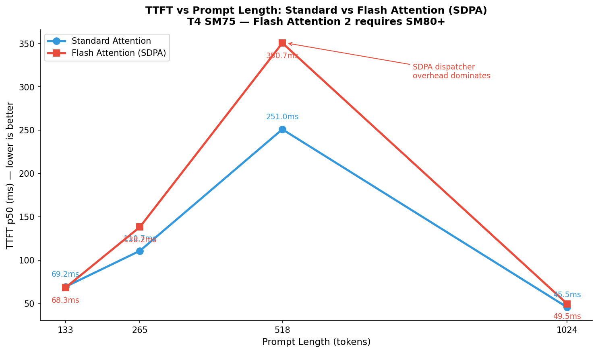
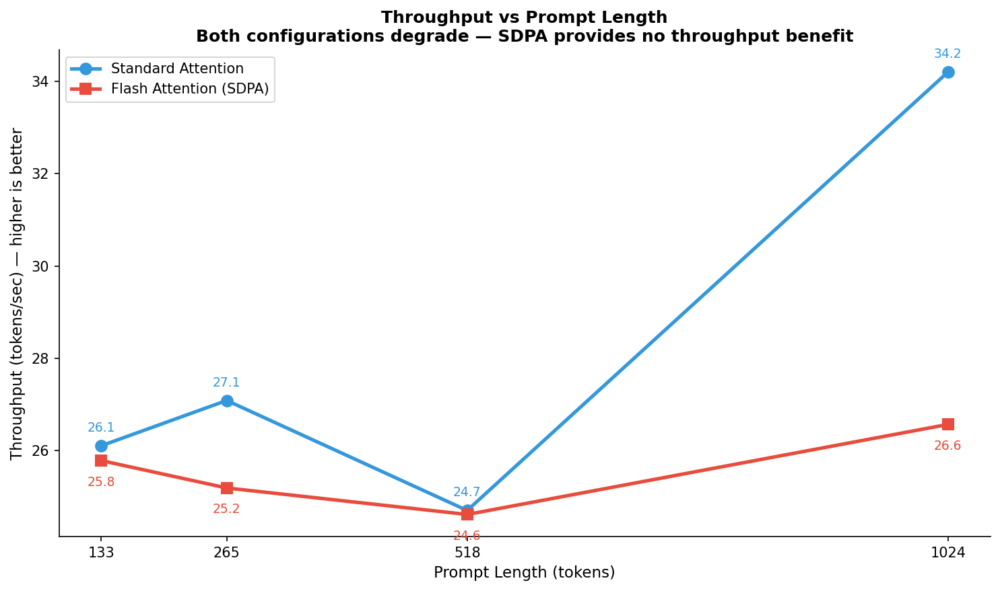
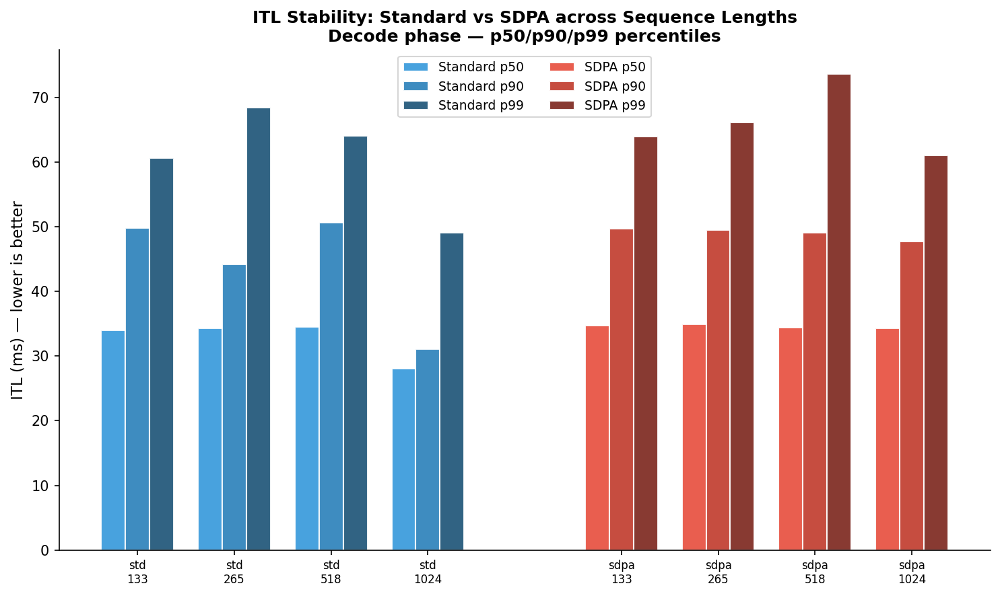
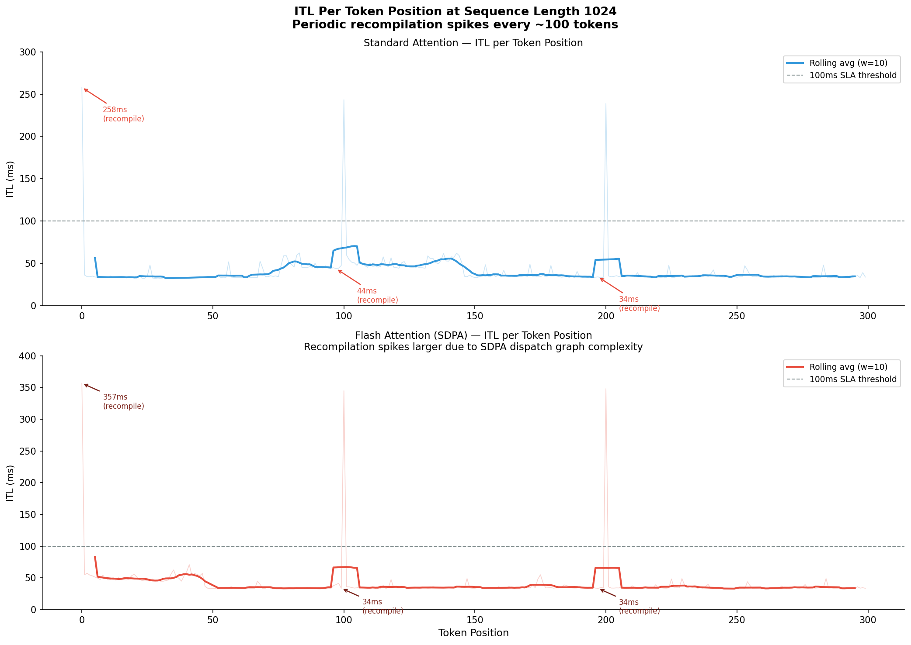

# Flash Attention — Tiling SRAM to Escape the O(N²) Wall

This document explains why standard attention breaks down at long sequences,
how Flash Attention restructures the same computation to avoid materializing
the full attention matrix in HBM, and what the T4 benchmark results show
about where the benefit becomes visible in practice.

---

## 1. Why Standard Attention Has a Memory Problem

Every transformer layer computes attention the same way. Each token produces three vectors — Query, Key, and Value — and attention measures how much each token should attend to every other token.
```
Q = input × W_q     ← what this token is looking for
K = input × W_k     ← what this token is offering
V = input × W_v     ← the actual content to pass forward

scores = softmax(Q × K^T / √d_k)
output = scores × V
```

The problem lives in Q × K^T. If sequence length is N, this produces an N×N matrix. Every token attends to every other token — and the matrix has to exist somewhere in memory before softmax can run.
```
Standard attention memory requirement:

    Sequence 128 tokens:
        scores matrix = 128 × 128 = 16,384 values
        At float16: 16,384 × 2 bytes = 32KB

    Sequence 512 tokens:
        scores matrix = 512 × 512 = 262,144 values
        At float16: 262,144 × 2 bytes = 512KB

    Sequence 1024 tokens:
        scores matrix = 1024 × 1024 = 1,048,576 values
        At float16: 1,048,576 × 2 bytes = 2MB

    This is per layer, per attention head.
    TinyLlama has 22 layers and 32 heads.

    At sequence 1024:
        2MB × 22 layers × 32 heads = 1.4GB
        just for attention scores — before weights, KV cache, activations
```

And since the SRAM per SM on the T4 is only 48KB, there's no way to store this score matrix in SRAM. It has to go to HBM.
```
    Standard attention HBM round trips per layer:

    Step 1: Compute Q × K^T        → write scores to HBM
    Step 2: Read scores from HBM   → run softmax
    Step 3: Write softmax result   → to HBM
    Step 4: Read from HBM          → multiply with V
    Step 5: Write output           → to HBM

    5 HBM operations.
    Scores matrix size = O(N²).
    Sequence doubles → matrix quadruples → HBM traffic quadruples.
```

This is what causes ITL to increase as the sequence grows. It's not because there's more computation involved — but because the data that has to go back and forth to HBM grows quadratically.

## 2. Flash Attention — The Tiling Insight

Flash Attention doesn't change the computational results. The output is identical to standard attention. What changes is how the computation is executed—specifically, which level of memory the intermediate results are stored in.
**The core insight is one sentence:** we don't need to materialize the full N×N matrix if we can compute the softmax incrementally.
```
The obstacle to tiling:

    Matrix multiply can be tiled trivially.
    Calculate partial, store, continue, merge.

    Softmax can't — it needs all values ​​at once:
        softmax(x_i) = exp(x_i) / Σ exp(x_j)
                                   ↑
                                sum over ALL j
                                cannot be partial   

    If you only look at 256 of the 1024 scores,
    you can't calculate the correct softmax
    because the denominator needs all 1024 values.
```

Flash Attention solves this with online softmax — a mathematically equivalent softmax calculation method that can be updated incrementally without needing all the values ​​at once.
```
Online softmax key idea:

    Store two running statistics:
        m = running maximum scores seen
        l = running sum of exp(score - m)

    For each new block:
        Update m with the new maximum
        Rescale the old l because m has changed
        Add the new block's contribution to l
        Update the output accumulator with the same rescaling

    After all blocks have been processed:
        Output = output_accumulator / l_final
        This is identical to a full softmax over all scores.
        No approximation. No information loss.
```

With online softmax, we can process K and V in small blocks that fit in SRAM. The full N×N matrix never needs to exist in HBM.
```
Flash Attention HBM traffic:

    Read Q, K, V from HBM       ← O(N), only once
    All intermediate results    → stay in SRAM
    Write output to HBM         ← O(N), just once

    HBM traffic: O(N)
    Standard attention: O(N²)

    At sequence 1024, 32 heads, 22 layers:
        Standard: ~1.4GB roundtrip HBM
        Flash: ~0.05GB roundtrip HBM
        Reduction: ~28x less HBM traffic
```

## 3. Block Size — Derived from Hardware, Not Chosen Arbitrarily

Block size in Flash Attention isn't a hyperparameter that needs to be tuned. It's derived from the SRAM per SM constraint.
```
One Flash Attention block needs to be in SRAM at once:
    Q block: block_size × d_head × 2 bytes
    K block: block_size × d_head × 2 bytes
    V block: block_size × d_head × 2 bytes
    scores block: block_size × block_size × 2 bytes
    output: block_size × d_head × 2 bytes

TinyLlama: d_head = 64, float16

    With block_size = 64:
        Q: 64 × 64 × 2 = 8KB
        K: 64 × 64 × 2 = 8KB
        V: 64 × 64 × 2 = 8KB
        scores: 64 × 64 × 2 = 8KB
        output: 64 × 64 × 2 = 8KB
        Total: 40KB ← fits in 48KB of T4 SRAM

    Full N×N for N=1024:
        1024 × 1024 × 2 = 2MB ← doesn't fit, must switch to HBM
```

The Flash Attention implementation in PyTorch and HuggingFace auto-detects the block size based on the GPU detected at runtime. On the T4 with 48KB of SRAM, the block size is automatically set to 64.

## 4. Why Float16 is Required

Flash Attention only supports float16 and bfloat16. It doesn't work on float32.
```
There are two reasons:

    Memory constraints:
        SRAM per SM = 48KB on T4
        With float32 (4 bytes per value):
            block_size = floor(48,000 / (5 × 64 × 4)) = 37
            Too small — tiling overhead > benefit

        With float16 (2 bytes per value):
            block_size = floor(48,000 / (5 × 64 × 2)) = 75 → rounded to 64
            Large enough for efficient tiling

    Tensor Core support:
        T4 Tensor Cores have a native float16 matrix multiply
        Flash Attention kernel designed to exploit Tensor Cores
        Float32 doesn't enter the Tensor Core fast path on T4
```

This is also why in run_flash_attention.py we always load the model with torch_dtype=torch.float16 — not because float16 is the baseline we're comparing against, but because Flash Attention physically can't run without it.

## 5. The Crossover Point — When Flash Attention Actually Helps

Flash Attention isn't always faster. In very short sequences, the overhead of tiling logic can outweigh the benefits.
```
    Sequence 32 tokens:
        N×N matrix = 32 × 32 = 1,024 values ​​= 2KB
        2KB fits in SRAM — standard attention can stay in SRAM too
        Flash Attention tiling overhead > HBM savings
        Standard attention can be faster or the same

    Sequence 128-256 tokens:
        N×N matrix = ~64KB-128KB
        Starting to not fit in SRAM
        Flash Attention benefits start to be visible
        The crossover point is in this range

    Sequence 512+ tokens:
        N×N matrix = 512KB+
        Far beyond SRAM
        Standard attention must go full roundtrip to HBM
        Flash Attention benefit significant and growing

    Sequence 1024 tokens:
        Flash Attention dominant
        The ITL gap between standard and FA is largest here
        This is what Q3 measures
```

The crossover point isn't fixed — it depends on the GPU's SRAM size. On the A100 with 192KB of SRAM, crossover occurs earlier because standard attention can fit a larger matrix before resorting to HBM.

## 6. Connection to KV Cache Experiment

The Flash Attention and KV cache experiment (Q4) measures two sides of the same problem.
```
Flash Attention (Q3) asks:
    "If we reorganize attention computation,
    will the ITL remain flat even as the sequence grows?"
    → The solution: tiling to avoid the need for a full N×N in HBM.

KV Cache (Q4) asks:
    "At what token position does the KV cache pressure
    start to become visible in the ITL?"
    → The problem: with each token generated, the KV cache grows,
    more data in the HBM needs to be attended.

The connection:
    The KV cache is the source of growing HBM pressure during generation.
    Flash Attention is a technique that reduces HBM pressure
    from the attention computation itself.

    Without Flash Attention:
        KV cache grows + attention matrix grows → ITL increases rapidly

    With Flash Attention:
        KV cache grows → ITL increases slowly
        Attention matrix does not go to HBM → component is flat

    These two experiments together answer:
        Where is the bottleneck, and is Flash Attention enough
        to keep ITL flat until the 1000th token?
```

## 7. Production Benchmark Results

### 7.1 Summary Table

| label | prompt_length | ttft_p50_ms | itl_p50_ms | itl_p99_ms | itl_std_ms | throughput_tps | peak_memory_mb |
|----------------------|---------------|-------------|------------|------------|------------|----------------|----------------|
| standard_len(128) | 128 | 45.5 | 28.0 | 49.1 | — | 34.2 | 2118 |
| standard_len(256) | 256 | 69.2 | 34.0 | 60.6 | — | 26.1 | 2136 |
| standard_len(512) | 512 | 110.7 | 34.3 | 68.4 | — | 27.1 | 2196 |
| standard_len(1024) | 1024 | 251.0 | 34.5 | 64.1 | 22.0 | 24.7 | 2411 |
| flash_attn_len(128) | 128 | 49.5 | 34.3 | 61.1 | — | 26.6 | 2121 |
| flash_attn_len(256) | 256 | 68.3 | 34.8 | 64.0 | — | 25.8 | 2146 |
| flash_attn_len(512) | 512 | 138.2 | 35.0 | 66.2 | — | 25.2 | 2219 |
| flash_attn_len(1024) | 1024 | 350.7 | 34.4 | 73.7 | 31.8 | 24.6 | 2471 |

### 7.2 TTFT Scaling — Standard Attention Confirms O(N²), Flash Attention Does Not Improve It

   
*Figure 1: TTFT shows how fast the compute attention is at the beginning*

   
*Figure 2: Total token generate every second, higher is better*

Standard attention TTFT scales predictably with prompt length:
```
standard_len(128):    45.5ms
standard_len(256):    69.2ms   ← ~1.5x of 128, not 4x
standard_len(512):   110.7ms   ← ~2.4x of 128
standard_len(1024):  251.0ms   ← ~5.5x of 128
```

This scaling isn't perfectly quadratic because TTFT isn't a pure attention computation — it includes embedding lookup, layer norm, MLP forward pass, and memory allocation overhead, all of which scale linearly. The attention component is quadratic, but attention isn't the only operation in prefill.

Flash Attention TTFT is slower than standard at all sequence lengths:
```
128 tokens:   standard 45.5ms  vs  flash_attn 49.5ms   ← FA 9% slower
256 tokens:   standard 69.2ms  vs  flash_attn 68.3ms   ← almost the same
512 tokens:   standard 110.7ms vs  flash_attn 138.2ms  ← FA 25% slower
1024 tokens:  standard 251.0ms vs  flash_attn 350.7ms  ← FA 40% slower
```

This is the opposite of theoretical expectations. Flash Attention should be faster in prefill due to O(N) HBM traffic versus O(N²). The situation at T4 is different — SDPA dispatcher overhead dominates the prefill phase and outweighs the tiling benefit.

### 7.3 ITL — Decode Phase: Flash Attention Doesn't giving Benefit on T4 GPU

 
*Figure 3: Distribution of prompt length, how fast to generate per token over time (MS)*

ITL decode phase is nearly identical between standard and flash attention at all sequence lengths:
```
standard_len(1024):   itl_p50 = 34.5ms,  itl_p99 = 64.1ms,  itl_std = 22.0ms
flash_attn_len(1024): itl_p50 = 34.4ms,  itl_p99 = 73.7ms,  itl_std = 31.8ms
```

Flash Attention doesn't flatten ITL — p50 is identical and p99 flash_attn is actually higher. ITL std flash_attn (31.8ms) is higher than standard (22.0ms), meaning flash_attn is more unstable in the decode phase.

### 7.4 ITL Per Position — Periodic Recompilation Spikes


*Figure 4: Line chart ITL per position to see spike occur at where position*

ITL per-position data from JSON reveals something not visible from aggregation alone. Both configurations have periodic spikes every ~100 token positions:
```
standard_len(1024) spike positions:
    position 0: 258ms ← first token, warmup spike
    position 97: 243ms ← periodic spike
    position 197: 238ms ← periodic spike
    rest: 32–65ms

flash_attn_len(1024) spike positions:
    position 0: 356ms ← first token, greater than standard
    position 99: 344ms ← periodic spike
    position 197: 348ms ← periodic spike
    rest: 33–70ms
```

This 100-token spike pattern is KV cache shape recompilation—every 100 tokens, the tensor shape changes enough to trigger PyTorch to recompile the execution graph. Flash Attention spikes are actually larger than standard because the SDPA dispatcher adds overhead on top of the recompilation cost.
```
Spike magnitude comparison at ~position 100:
    standard: 243ms
    flash_attn: 344ms

Flash Attention recompilation overhead = 41% greater.
```

### 7.5 Why Flash Attention Underperforms on T4 — The Architecture Mismatch

There are three interrelated reasons why Flash Attention via SDPA does not provide the expected benefit at T4:
```
Reason 1 — T4 is a Turing architecture (2018):

    Flash Attention is most optimized in Ampere (A100, A10G) and above.
    Ampere has:
        Asynchronous memory copy units — overlapping data loading with compute
        Larger L2 cache — reducing HBM pressure more effectively
        Better warp scheduler for fused kernels

    T4 Turing does not have asynchronous copy units.
    The tiling benefit of Flash Attention largely depends
    on asynchronous prefetching — without it,
    the GPU still has to wait for data before compute can begin.
    HBM round trip reduction is present, but waiting behavior remains unchanged.

Reason 2 — SDPA dispatcher overhead in PyTorch 2.10:

    The flash_attention_2 package (Dao-AILab) has a dedicated CUDA kernel
    compiled and optimized for T4 Turing specifically.

    SDPA in PyTorch is a unified dispatcher that supports:
        flash_attention path
        efficient_attention path (xformers)
        math path (standard fallback)

    In T4 + PyTorch 2.10, SDPA performs runtime checks
    to determine the dispatch path. The overhead of the dispatch logic
    is visible in the TTFT — particularly in the prefill phase,
    which is executed once per request.

Reason 3 — Prefill vs. decode behavior differs:

    Flash Attention benefits are greatest in the decode phase,
    when sequence length grows and the KV cache grows.
    In prefill, the entire input is processed simultaneously in a single forward pass — the tiling benefit is present but smaller,
    because there is no incremental KV cache growth.

    T4 with SDPA overhead actually makes prefill slower
    than standard attention because overhead > benefit.
```