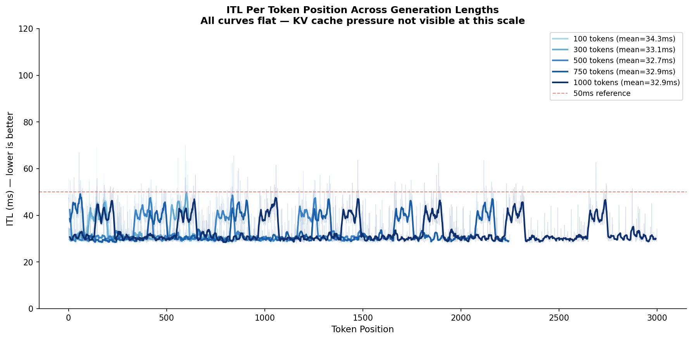
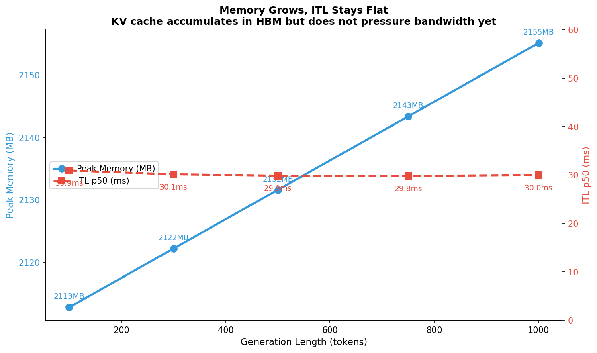
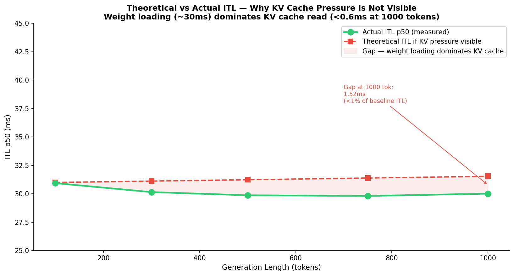
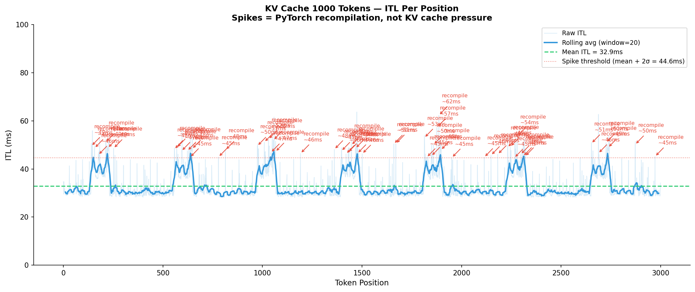

# KV Cache — Why TinyLlama Does Not Show Pressure at 1000 Tokens

This document explains what KV cache is at the hardware level, why it
should theoretically cause ITL to rise as generation grows, and why
that rise is not visible in TinyLlama at 1000 tokens — and what that
absence tells us about the model and the hardware.

---

## 1. What KV Cache Is and Why It Exists

Every decode step, the model needs to compute attention — each new token must attend to every token that came before it. Without caching, this means re-computing Query, Key, and Value vectors for all previous tokens from scratch on every step.
```
Without KV cache — token 100:
    Re-compute K and V for token 1
    Re-compute K and V for token 2
    ...
    Re-compute K and V for token 99
    Compute token 100
    Total: 100 full forward passes worth of attention work
```

KV cache solves this by storing the Key and Value vectors from previous tokens in HBM. Each decode step only computes K and V for the new token, then reads the cached K and V for all previous tokens from HBM.
```
With KV cache — token 100:
    Read cached K, V for tokens 1-99 from HBM
    Compute K, V for token 100 only
    Attend: new Q against all cached K
    Total: 1 forward pass worth of new compute
           + read 99 cached KV pairs from HBM
```

The trade-off is explicit: we trade compute for memory. KV cache grows every token, and every token we must read the entire cache from HBM.

## 2. Why KV Cache Should Cause ITL to Rise

The memory cost per decode step is not fixed — it grows linearly with sequence length.
```
KV cache size per token in TinyLlama:
    22 layers × 32 heads × 64 d_head × 2 (K and V) × 2 bytes (float16)
    = 22 × 32 × 64 × 4
    = 180,224 bytes ≈ 0.18MB per token

At token position N, total KV cache = N × 0.18MB

    Token 1:    0.18MB in cache
    Token 100:  18MB in cache
    Token 500:  90MB in cache
    Token 1000: 180MB in cache
```

Every token generated, the GPU must read the entire KV cache from HBM before it can compute attention. More cache = more data movement = higher ITL.
```
HBM read time per token at T4 (~300 GB/s bandwidth):

    Token 1:    0.18MB / 300 GB/s = 0.0006ms  — negligible
    Token 100:  18MB   / 300 GB/s = 0.06ms    — still small
    Token 500:  90MB   / 300 GB/s = 0.3ms     — visible
    Token 1000: 180MB  / 300 GB/s = 0.6ms     — measurable

    But baseline ITL is ~30ms from weight loading alone
    (2.2GB weights / 300 GB/s = 7.3ms minimum per token)

    KV cache contribution at token 1000:
    0.6ms / 30ms = 2% of total ITL
    — too small to be visible above measurement noise
```

## 3. The Benchmark Results

### 3.1 Summary Table

| label | mean_tokens | itl_p50_ms | itl_p99_ms | itl_std_ms | throughput_tps | peak_memory_mb |
|------------------|-------------|------------|------------|------------|----------------|----------------|
| kv_cache_100tok  | 100 | 30.94 | 55.60 | — | 29.1 | 2113 |
| kv_cache_300tok  | 300 | 30.15 | 51.43 | — | 30.2 | 2122 |
| kv_cache_500tok  | 500 | 29.87 | 51.61 | — | 30.6 | 2132 |
| kv_cache_750tok  | 750 | 29.81 | 53.04 | — | 30.4 | 2143 |
| kv_cache_1000tok | 1000 | 30.01 | 51.31 | — | 30.4 | 2155 |

### 3.2 ITL is Flat — No Pressure Visible

    
*Figure 1: All five generation lengths produce flat ITL curves — no systematic rise visible.*

ITL p50 does not rise across generation lengths. The range is 29.81ms to 30.94ms — a 1.1ms spread that is within normal measurement variance, not a systematic trend.
```
Expected if KV cache pressure were visible:
    kv_cache_100tok:  itl_p50 = 30ms
    kv_cache_300tok:  itl_p50 = 33ms
    kv_cache_500tok:  itl_p50 = 37ms
    kv_cache_750tok:  itl_p50 = 42ms
    kv_cache_1000tok: itl_p50 = 48ms

Actual:
    kv_cache_100tok:  itl_p50 = 30.94ms
    kv_cache_300tok:  itl_p50 = 30.15ms
    kv_cache_500tok:  itl_p50 = 29.87ms
    kv_cache_750tok:  itl_p50 = 29.81ms
    kv_cache_1000tok: itl_p50 = 30.01ms

    Flat. No trend. No pressure.
```

  
*Figure 2: Memory grows as expected from KV cache accumulation, but ITL does not follow.*

Memory footprint does grow — 2113MB at 100 tokens to 2155MB at 1000 tokens, a 42MB increase. This matches the theoretical 0.18MB per token × 900 additional tokens = 162MB — slightly lower because peak_memory_mb captures the maximum allocated, not the steady-state cache size.

### 3.3 Answer to Q4
```
Q4: At which token position does KV cache pressure become visible?

Answer for TinyLlama 1.1B on T4:
    Not visible within the 1000 token generation window.

Root cause:
    TinyLlama KV cache = 0.18MB per token
    At token 1000: cache = 180MB
    T4 VRAM = 16,384MB — cache is 1.1% of total VRAM
    T4 HBM bandwidth = 300 GB/s
    KV cache read time at token 1000 = 0.6ms
    Baseline ITL from weights = ~30ms
    KV cache contribution = 2% — below measurement noise floor

When KV cache pressure would become visible for TinyLlama:
    Inflection point estimated at ~10,000–12,000 tokens
    At that point: cache ≈ 1.8–2.2GB = 10–14% of weight load
    Contribution rises to 10–15% of ITL — measurable
    But TinyLlama max context window = 2048 tokens
    The inflection point is unreachable with this model

What would show visible pressure at 1000 tokens:
    Larger model (7B+) with bigger KV cache per token
    Or quantized KV cache to extend context length
    Or hardware with lower HBM bandwidth where cache contribution larger
```


*Figure 3: Theoretical ITL if KV cache pressure were visible vs actual flat measurement.*

## 4. Connection to Flash Attention Experiment

Flash Attention experiments (Q3) show that FA over SDPA does not flatten ITL at T4. KV cache experiments (Q4) explain why FA ITL flattening is not even necessary for TinyLlama at this range.
```
If FA worked on T4 (hypothetical):
    FA reduces attention matrix HBM traffic O(N²) → O(N)
    At 1000 tokens, attention matrix ≈ 1×N = 2KB — trivial
    FA benefit at decode = near zero for this model size

    KV cache is the bottleneck — not the attention matrix.
    FA solve attention matrix pressure, not KV cache pressure.
    Even with perfect FA, ITL would still be flat
    because the bottleneck is weight loading, not attention.
```

This is why the two experiments form a complete picture — FA addresses one source of HBM pressure, KV cache is a different source, and for TinyLlama neither is the dominant bottleneck at batch size 1.

## 5. Limitations
```
KV cache pressure not observable within TinyLlama context window.
    Model max context = 2048 tokens.
    Theoretical inflection point ~10,000–12,000 tokens.
    Requires larger model or extended context experiment to observe.

Experiment measures aggregate ITL, not per-position ITL per length.
    Per-position data only available from JSON for individual runs.
    Cross-length per-position comparison requires loading all JSONs
    in analysis notebook.

Recompilation spikes every ~100 tokens affect ITL distribution.
    Periodic spikes from KV cache shape recompilation are present
    in this experiment as in FA experiment.
    These spikes are separate from KV cache pressure —
    addressed separately in Flash Attention findings.
```


*Figure 4: Periodic spikes at ~100 token intervals are recompilation events, not KV cache pressure.*