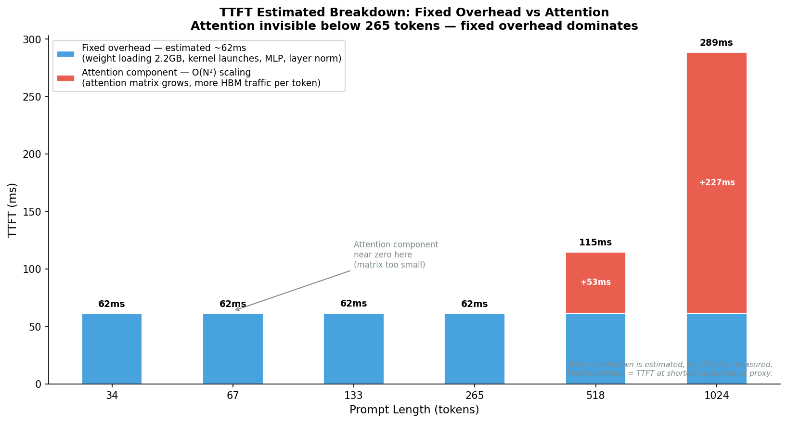
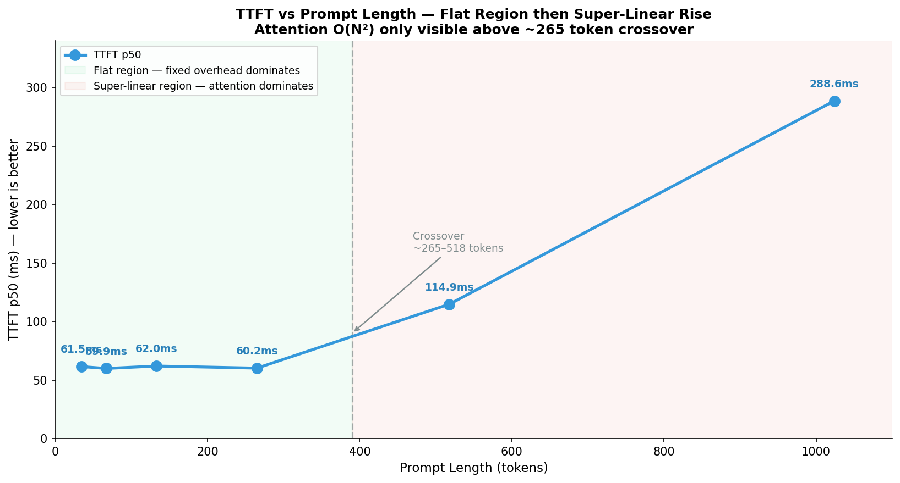
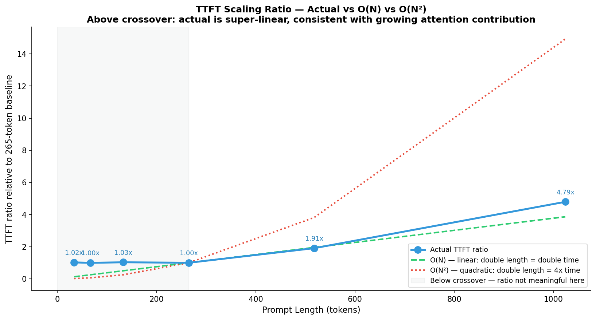

# Context Length — When Attention Complexity Becomes the Bottleneck

This document explains why TTFT stays flat at short prompts despite O(N²)
attention complexity, identifies the exact sequence length where attention
begins to dominate prefill cost, and quantifies the quadratic scaling
behavior that emerges at long prompts on T4.

---

## 1. Why TTFT Should Scale with Prompt Length

Every time a model processes a prompt, it runs a full forward pass over all input tokens simultaneously — this is called the prefill phase. TTFT measures how long this phase takes before the first output token is produced.
Standard attention prefill complexity is O(N²) in sequence length. For every input token, attention must compute similarity against every other token — producing an N×N scores matrix that must be written to HBM before softmax can run.
```
Attention matrix size at prefill:

    N=128:  128 × 128 = 16,384 values  × float16 = 32KB per head
    N=256:  256 × 256 = 65,536 values             = 128KB per head
    N=512:  512 × 512 = 262,144 values             = 512KB per head
    N=1024: 1024 × 1024 = 1,048,576 values         = 2MB per head

    TinyLlama: 32 heads × 22 layers

    N=512:  512KB × 32 × 22 = 358MB total attention scores
    N=1024: 2MB   × 32 × 22 = 1.4GB total attention scores
```

If attention were the only operation in prefill, TTFT would scale quadratically — doubling sequence length would quadruple TTFT. But prefill also includes embedding lookup, 22 × layer norm, 22 × MLP forward pass, and memory allocation — all of which scale linearly or are fixed overhead regardless of sequence length.

## 2. Why TTFT is Flat at Short Sequences

At short sequences, fixed overhead dominates. The GPU must load all 2.2GB of TinyLlama weights from HBM regardless of how short the prompt is — this cost is constant.
```
Fixed overhead per prefill (sequence-independent):
    Weight loading:    2.2GB / 300 GB/s = ~7.3ms minimum
    Kernel launches:   220 × ~10µs = ~2.2ms
    Memory allocation: ~1-2ms
    Layer norm × 22:   fixed cost
    MLP × 22:          scales with hidden dim, not sequence length

    Total fixed floor: ~12-15ms minimum per forward pass

Attention cost at short sequences:
    N=34:  attention matrix = 34 × 34 × 32h × 22l × 2 bytes = 1.6MB
           HBM read time = 1.6MB / 300 GB/s = 0.005ms — negligible
    N=265: attention matrix = 265 × 265 × 32h × 22l × 2 bytes = 99MB
           HBM read time = 99MB / 300 GB/s = 0.33ms — still small

    At N=265, attention contributes <1% of total TTFT.
    Fixed overhead of ~60ms completely masks it.
```

      
*Figure 1: Estimated TTFT breakdown into fixed overhead (blue) and attention component (red).

This is why TTFT looks flat from 34 to 265 tokens — not because there is no scaling, but because the quadratic component is too small to emerge above the fixed overhead floor.

## 3. The Crossover Point — Where Attention Begins to Dominate

The crossover happens between 265 and 518 tokens in our T4 benchmark. This is where attention matrix size becomes large enough to add measurable HBM traffic on top of fixed overhead.
```
Our T4 results:

    len=34:   ttft_p50 = 61.5ms  ← flat
    len=67:   ttft_p50 = 59.9ms  ← flat
    len=133:  ttft_p50 = 62.0ms  ← flat
    len=265:  ttft_p50 = 60.2ms  ← flat
    len=518:  ttft_p50 = 114.9ms ← attention visible, 1.9x from baseline
    len=1024: ttft_p50 = 288.6ms ← attention dominant, 4.7x from baseline

Crossover: between 265 and 518 tokens.
At 518 tokens, attention matrix = 358MB.
358MB / 2200MB weights = 16% additional HBM traffic.
Visible in TTFT as 90% increase over baseline.
```

The scaling from 518 to 1024 is more revealing. Sequence doubles from 518 to 1024 — and TTFT goes from 114.9ms to 288.6ms, a 2.51x increase. Pure quadratic would predict 4x. The actual ratio is 2.51x because linear-scaling operations (MLP, embeddings) dilute the quadratic signal — but the super-linear trend is clearly confirmed.
```
Scaling ratio test:
    512 → 1024 tokens = 2x sequence length
    Pure O(N²):  TTFT should multiply by 4
    Pure O(N):   TTFT should multiply by 2
    Actual:      114.9ms → 288.6ms = 2.51x

    Result: super-linear but not fully quadratic.
    Mixed complexity — O(N²) attention + O(N) linear operations.
    As sequence grows longer, quadratic component increasingly dominates.
    At N=2048 (max context), attention would be near-fully dominant.
```

    
*Figure 2: TTFT p50 across prompt lengths. Green region = flat zone where fixed overhead

## 4. Answer to Q6  
```
Q6: Does prompt length affect TTFT in a way consistent with O(N²) complexity?

Answer: Yes, but only above a sequence length threshold.

    Below ~265 tokens:
        TTFT = flat at ~60ms
        Attention matrix too small to emerge above fixed overhead
        Quadratic component < 1% of total TTFT

    Above ~518 tokens:
        TTFT rises super-linearly
        Quadratic component becomes visible and growing
        At 1024 tokens: 4.7x baseline TTFT

    Scaling from 518 → 1024 (2x sequence):
        TTFT ratio = 2.51x
        Consistent with mixed O(N²) + O(N) complexity
        Pure O(N²) would show 4x — diluted by linear operations

    Flash Attention implication:
        FA eliminates O(N²) HBM traffic from attention matrix
        On hardware that supports FA (Ampere+), TTFT above crossover
        would scale closer to O(N) instead of O(N²)
        On T4 (Turing), SDPA overhead negates FA benefit — confirmed
        in Flash Attention experiment (Q3)
```

    
*Figure 3: Actual TTFT ratio vs theoretical O(N) and O(N²) predictions, baseline at 265 tokens.

## 5. Production Implications   
```
The flat region below 265 tokens is a false sense of safety.

A developer who benchmarks with a 100-token prompt sees TTFT = 62ms
and approves the deployment. In production, users send longer prompts:
    RAG context:         500 tokens → TTFT 114ms
    Few-shot examples:   600 tokens → TTFT ~140ms
    Long conversation:   800 tokens → TTFT ~200ms
    Document analysis:  1024 tokens → TTFT 288ms

The 288ms TTFT at 1024 tokens is 4.7x the 62ms at 100 tokens.
If the SLA was set at 100ms based on short-prompt testing,
production with long prompts breaches SLA immediately.

Production recommendation:
    Always benchmark TTFT at the p99 of expected prompt lengths
    in production, not just at a single representative length.
    The quadratic region is where user experience degrades fastest.
```