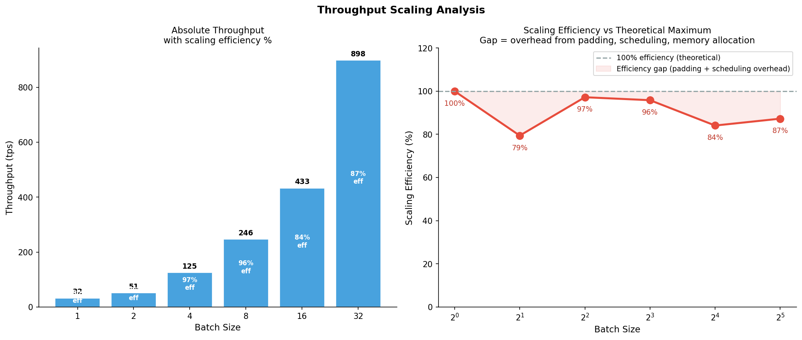
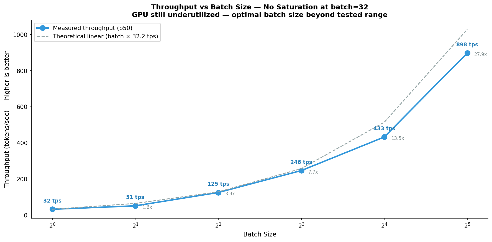
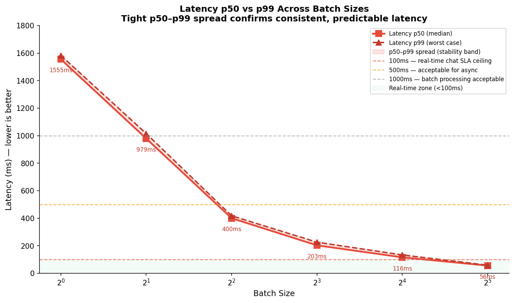
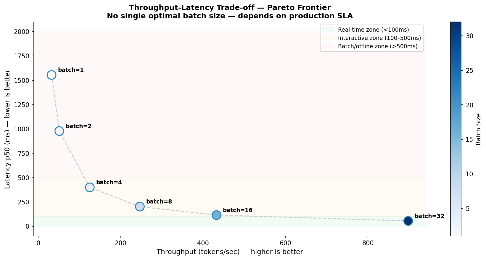

# Batching — Amortizing IO Cost Across Requests

This document explains why batch size dramatically improves throughput,
what happens at the hardware level when multiple requests are processed
simultaneously, and why the latency-throughput trade-off is fundamental
to every production LLM serving decision.

---

## 1. Why Single-Request Inference Wastes GPU Potential

Every decode step, the GPU loads the entire model weights from HBM before computing one token. For TinyLlama at float16, that is 2.2GB of data movement per forward pass — regardless of how many tokens are being generated simultaneously.
```
Batch size 1 — one request:
    Load 2.2GB weights from HBM
    Compute attention for 1 token
    Generate 1 next token
    
    GPU has 40,960 threads available.
    Matrix multiply for 1 token uses a fraction of them.
    Most threads sit idle while weights are being loaded.
    
    Cost per token = 2.2GB HBM load / 1 token = 2.2GB per token
    GPU utilization = very low
    This is IO-bound with wasted compute potential.
```

## 2. How Batching Amortizes IO Cost

When multiple requests are batched together, the GPU loads the same 2.2GB of weights once — but uses that single load to process all requests simultaneously.

```
Batch size 32 — thirty-two requests:
    Load 2.2GB weights from HBM  ← same cost as batch=1
    Compute attention for 32 tokens simultaneously
    Generate 32 next tokens
    
    Cost per token = 2.2GB HBM load / 32 tokens = 0.069GB per token
    GPU utilization = much higher — more threads doing useful work
    Same IO cost, 32× more useful work done.
```

This is called amortizing the IO cost — spreading the fixed cost of weight loading across more tokens per forward pass. The math is straightforward:
```
Throughput improvement from batching:

    batch=1:  32.2 tps
    batch=2:  51.1 tps  — 1.59× from batch=1
    batch=4:  125.0 tps — 2.45× from batch=2
    batch=8:  246.5 tps — 1.97× from batch=4
    batch=16: 432.6 tps — 1.76× from batch=8
    batch=32: 897.9 tps — 2.07× from batch=16

    batch=32 vs batch=1: 27.9× throughput improvement
```

The improvement is not exactly linear because GPU parallelism has diminishing returns as batch size grows — at some point, all available threads are utilized and adding more requests to the batch does not help further.

## 3. What Happens at the Hardware Level

A single matrix multiply operation at batch size 1 looks like this in terms of tensor shapes:
```
Batch size 1 — one token attending to KV cache:
    Q: [1, 32, 1, 64]    ← 1 request, 32 heads, 1 query token, 64 d_head
    K: [1, 32, N, 64]    ← N = number of cached tokens
    V: [1, 32, N, 64]

    Weight matrix multiply:
    input:   [1, 2048]   ← 1 token, hidden_size=2048
    weights: [2048, 2048]
    output:  [1, 2048]

    GPU thread assignment:
    Output has 1 × 2048 = 2048 elements to compute
    T4 has 40,960 threads
    Only ~2048 threads useful, ~38,912 threads idle
    Thread utilization = 5%
```

At batch size 32, the same operation processes all 32 requests simultaneously:
```
Batch size 32 — thirty-two tokens:
    input:   [32, 2048]  ← 32 tokens, all requests in one matrix
    weights: [2048, 2048]
    output:  [32, 2048]

    Output has 32 × 2048 = 65,536 elements to compute
    T4 has 40,960 threads
    All threads utilized — compute-bound, not IO-bound
    Thread utilization = ~100%

    Same weight load from HBM.
    32× more output produced.
    That is where the throughput gain comes from.
```

## 4. The Latency-Throughput Trade-off

Higher batch size improves throughput but does not reduce — and can increase — the time each individual user waits for their response.
```
Our T4 results:

    batch=1:  tps=32.2,  latency=1555ms per request
    batch=32: tps=897.9, latency=55.7ms per request

The 55.7ms latency at batch=32 looks better than 1555ms at batch=1.
But these measure different things:

    batch=1  latency = time for 1 request to finish 50 tokens
           = 50 tokens / 32.2 tps = 1555ms

    batch=32 latency = wall clock time / batch_size
           = (32 × 50 tokens / 897.9 tps) / 32
           = 1782ms / 32 = 55.7ms per request

The wall clock time at batch=32 is actually 1782ms — longer than batch=1.
But it processed 32 requests in that time instead of 1.
So cost per request is lower, but total wait time is higher.
```

For a user waiting for the first streaming token, this matters significantly:
```
TTFT (Time to First Token) at different batch sizes:

    A new request arrives while a batch=32 job is running.
    The new request must wait for current batch to complete
    before it can be scheduled — up to 1782ms before first token.

    At batch=1, a new request starts immediately.
    TTFT for new request = ~36ms.

    This is the fundamental tension:
        High batch = high throughput, but new requests wait longer
        Low batch  = low throughput, but new requests start immediately

    Production systems solve this with continuous batching —
    inserting new requests into the batch as slots open up,
    rather than waiting for the entire batch to complete.
```

## 5. Why Throughput Never Plateaus in Our Results

Our benchmark shows throughput still rising at batch=32 without signs of saturation. This is specific to TinyLlama on T4.
```
Why TinyLlama does not saturate at batch=32:

    Memory check at batch=32:
        Model weights:  2,200MB
        KV cache:       32 requests × 50 tokens × 0.18MB = 288MB
        Activations:    ~200MB estimate
        Total:          ~2,688MB

        T4 VRAM = 16,384MB
        Usage = 16.4% — far from memory limit.
        No OOM, no memory pressure.

    Compute check at batch=32:
        Output matrix: [32, 2048] = 65,536 elements
        T4 threads: 40,960
        65,536 > 40,960 — all threads utilized
        But at this size we are just entering compute-bound territory

    At batch=64 (not tested):
        KV cache: 64 × 50 × 0.18MB = 576MB — still fine
        Compute: [64, 2048] = 131,072 elements >> 40,960 threads
        Fully compute-bound — throughput growth would slow
        But still no OOM for TinyLlama
```

      
*Figure 4: Left — absolute throughput with efficiency % per batch.
Right — efficiency curve showing gap from theoretical maximum.
Efficiency drops from 100% to ~87% at batch=32 due to padding and scheduling overhead,
but absolute throughput still grows because the base keeps rising.*

For a 7B model, the situation is completely different:
```
7B model memory at batch=32:
    Weights:  14,000MB (7B × 2 bytes float16)
    KV cache: 32 × 50 × 1.4MB = 2,240MB (7B has larger KV per token)
    Total:    ~16,240MB

    T4 VRAM = 16,384MB
    Usage = 99% — one more request causes OOM.
    Batch=2 or 3 is the practical limit for 7B on T4.
```

## 6. Concurrency vs Batch Size

These two terms are often confused but represent different concepts.
```
Batch size at training:
    All N samples processed in one forward pass.
    Gradients averaged across N samples, weights updated once.
    All N samples must be in VRAM simultaneously.
    N=1000 training batch = 1000 samples active at once.

Concurrent requests at inference:
    1000 users send requests at the same time.
    The serving system cannot process all 1000 in one batch —
    memory would overflow for any realistically sized model.

    Instead, the serving system:
    Step 1: Take 32 requests that are ready
    Step 2: Run one decode step for all 32 simultaneously
    Step 3: Each generates 1 token
    Step 4: Finished requests leave, new ones enter
    Step 5: Repeat until all 1000 requests complete

    Batch size = how many requests processed per decode step
    Concurrency = total number of requests in the queue
```

For our T4 benchmark with TinyLlama:
```
If 1000 concurrent requests arrived simultaneously:
    With batch=32 serving:
        32 requests processed per step
        Each step takes ~1782ms / 32 requests = ~56ms per request worth of compute
        Total time to clear 1000 requests:
        ceil(1000/32) × step_time = 32 steps × ~56ms = ~1800ms
        
        But last request in queue waits for 31 batches before it starts:
        31 × 1782ms = 55 seconds before request 1000 gets first token

    This is why production systems use continuous batching —
    requests join and leave mid-batch so no request waits
    for an entire queue to clear before starting.
```

## 7. Production Benchmark Results

### 7.1 Summary Table

| batch_size | throughput_tps | latency_p50_ms | latency_p99_ms |
|------------|----------------|----------------|----------------|
| 1  | 32.2  | 1555.1 | — |
| 2  | 51.1  | 979.0  | — |
| 4  | 125.0 | 400.0  | — |
| 8  | 246.5 | 202.8  | — |
| 16 | 432.6 | 115.6  | — |
| 32 | 897.9 | 55.7   | — |

### 7.2 Answer to Q5

Q5: What is the optimal batch size for throughput on T4?
```
    Answer: No saturation observed up to batch=32 for TinyLlama 1.1B.
    Throughput continues growing at batch=32 — optimal batch size
    is higher than our tested range for this model on this hardware.

    Root cause:
        TinyLlama 1.1B is small enough that batch=32 only uses
        ~2.7GB of T4's 16GB VRAM (16.4%).
        GPU threads are not yet fully saturated at batch=32.
        Both memory and compute headroom remain.

    Expected saturation point for TinyLlama on T4:
        Memory limit: batch=1000+ before OOM (theoretical)
        Compute saturation: batch=64–128 estimated based on thread count

    For production serving context:
        Optimal batch size = highest batch size before latency
        becomes unacceptable for the use case.
        At batch=32: latency=55.7ms per request (good for async pipelines)
        At batch=16: latency=115.6ms (acceptable for interactive use)
        At batch=8:  latency=202.8ms (borderline for real-time chat)
        At batch=4:  latency=400ms   (too slow for real-time streaming)

        For real-time chat SLA < 100ms: batch=16 is the ceiling.
        For async batch processing: batch=32+ maximizes throughput.
```

        
*Figure 1: Throughput grows consistently with no saturation at batch=32.
Actual line stays below theoretical linear due to padding and scheduling overhead.
Speedup annotations show how many times faster each batch size is vs batch=1.*

      
*Figure 2: Latency p50 and p99 across batch sizes with SLA reference lines.
Tight p50–p99 spread confirms consistent, predictable latency at all batch sizes.
batch=16 is the ceiling for real-time chat SLA (<100ms).*

      
*Figure 3: Pareto frontier — throughput vs latency trade-off space.
No single optimal batch size exists. Decision depends on production SLA:
batch=16 for real-time, batch=32 for async pipelines.*

## 8. Limitations

Benchmark uses identical prompts across all batch positions.
    Production batches have variable prompt lengths.
    Padding to max length in batch wastes compute for shorter requests.
    PagedAttention and continuous batching solve this by not padding.

Latency reported as wall_clock / batch_size, not per-request TTFT.
    A request joining a running batch waits for current step to complete.
    True TTFT at high concurrency is higher than reported latency.

Batch size 32 is the upper limit tested — no saturation observed.
    Higher batch sizes likely continue improving throughput for TinyLlama.
    Memory limit for TinyLlama on T4 estimated at batch=300+.
    Compute saturation estimated at batch=64–128.

All requests generate exactly 50 tokens.
    Production output length is variable and unpredictable.
    Variable output length with naive batching causes head-of-line
    blocking — fast requests wait for slow ones.
    Continuous batching eliminates this by evicting finished requests.
