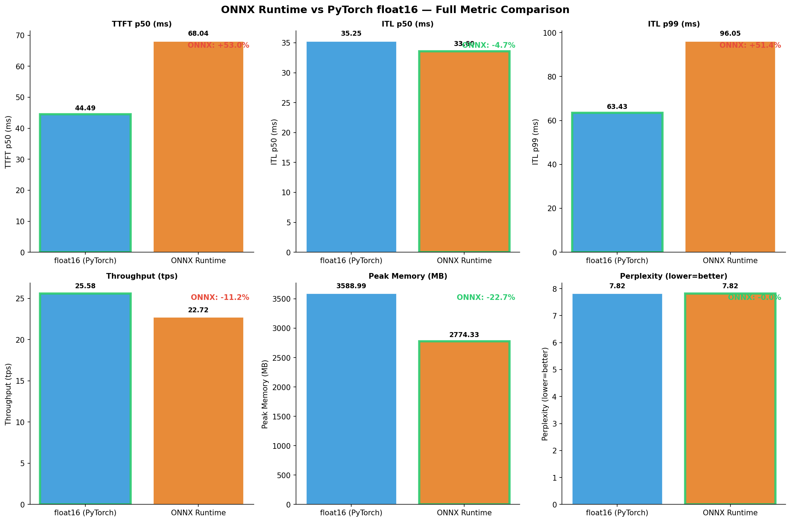
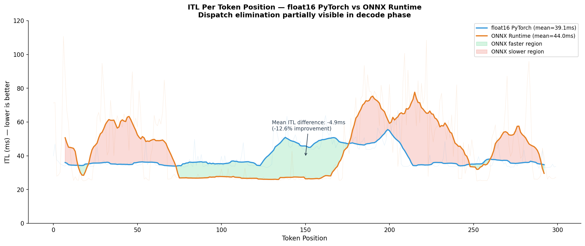
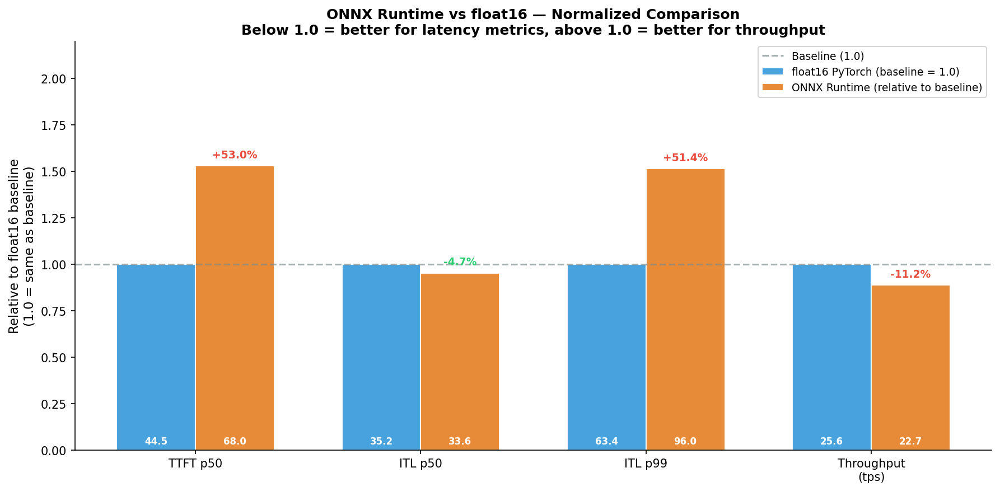

# ONNX Runtime — Static Graph Execution and Dispatch Overhead Elimination

This document explains the fundamental difference between PyTorch dynamic graph
execution and ONNX static graph execution, why eliminating Python dispatch overhead
should theoretically improve inference speed, and what the T4 benchmark results
reveal about why the expected benefit did not fully materialize with the
ORTModelForCausalLM implementation.

---

## 1. The Problem: Python Dispatch Overhead in PyTorch Eager Mode

Every time PyTorch executes a forward pass, Python is involved in every single operation. PyTorch uses a "define by run" approach — the computation graph is built and executed simultaneously, line by line, with Python driving each step.
```
    PyTorch forward pass — one token:

        Python reads operation 1: embedding lookup
        → Python dispatches to GPU driver
        → GPU driver schedules kernel
        → GPU executes (~1ms)
        → Python reads operation 2: layer norm
        → Python dispatches to GPU driver
        → GPU driver schedules kernel
        → GPU executes (~0.3ms)
        → ... repeat for all ~220 operations ...

    Fixed overhead per dispatch: ~5–20 microseconds
    Total dispatch overhead: 220 × 10µs = 2.2ms per token

    This 2.2ms happens before any actual computation begins.
    At ITL ~35ms, dispatch overhead is ~6% of total token time.
    At very fast future hardware, this percentage would grow.
```

The GPU is capable of faster execution — it simply waits for Python to issue the next command between every operation. This waiting is called dispatch overhead, and it is unavoidable in PyTorch eager mode.

## 2. How ONNX Eliminates Dispatch Overhead

ONNX — Open Neural Network Exchange — is a format for representing computation graphs as static, portable files. When a model is exported to ONNX, the entire computation graph is traced, resolved, and saved as a fixed execution plan.
```
ONNX export process (happens once):

    Step 1: Trace model with sample input
            Record every operation in order
            Record all tensor shapes and dependencies

    Step 2: Graph optimization
            Fuse compatible operations
            Eliminate redundant operations
            Constant folding — precompute values that never change

    Step 3: Build execution plan
            Resolve execution order for all operations
            Assign operations to execution providers (GPU/CPU)
            Save complete plan to .onnx file

ONNX Runtime inference (every token):
    Input → execution plan runs → output
    No Python interpreter involvement
    No per-operation dispatch
    No driver scheduling overhead
    GPU runs continuously without CPU interruption
```

The difference in execution timeline:
```
PyTorch eager mode (per token):
    [dispatch][kernel][dispatch][kernel][dispatch][kernel]...
     ^CPU      ^GPU    ^CPU      ^GPU    ^CPU      ^GPU
     gaps between kernels = dispatch overhead from CPU

ONNX Runtime (per token, theoretical):
    [kernel][kernel][kernel][kernel][kernel][kernel]...
     ^GPU    ^GPU    ^GPU    ^GPU    ^GPU    ^GPU
     gaps between kernels = near zero, no CPU involvement
```

Additionally, ONNX Runtime can fuse multiple operations into single kernels at export time — the same benefit as Flash Attention but applied to linear layers, layer norms, and activation functions. Fewer kernels mean fewer HBM round trips for intermediate results.

## 3. Why the Expected Benefit Did Not Fully Materialize

The benchmark results show ONNX Runtime underperforming float16 PyTorch baseline on most metrics.
```
float16 PyTorch baseline (from quantization experiment):
    ttft_p50     = 44.5ms
    itl_p50      = 35.2ms
    throughput   = 25.6 tps
    perplexity   = 7.817
    memory       = 3,589MB

ONNX Runtime (this experiment):
    ttft_p50     = 68.0ms   ← 53% slower than float16
    itl_p50      = 33.6ms   ← 4% faster than float16 ✓
    throughput   = 22.7 tps ← 11% slower than float16
    perplexity   = 7.816    ← identical quality
    memory       = 2,774MB  ← smaller footprint
```

Three reasons explain why ONNX did not deliver the expected speedup:
```
Reason 1 — ORTModelForCausalLM is a HuggingFace wrapper:

    We used ORTModelForCausalLM from Optimum library,
    not raw OnnxRuntime InferenceSession.
    
    ORTModelForCausalLM wraps ORT with HuggingFace interface:
        model.generate() → still Python-driven generation loop
        Each generate step → Python calls forward()
        forward() → ORT execution plan runs
        
    Python overhead is reduced but not eliminated.
    The generate() loop itself is Python and has overhead.
    Pure ORT InferenceSession would be faster but requires
    manual token generation loop without HuggingFace utilities.

Reason 2 — Dynamic shapes in autoregressive generation:

    ONNX static graph works best with fixed tensor shapes.
    Autoregressive generation has dynamic shapes:
        Step 1: input = [1, prompt_len],     KV cache = [1, 32, 0, 64]
        Step 2: input = [1, prompt_len+1],   KV cache = [1, 32, 1, 64]
        Step N: input = [1, prompt_len+N-1], KV cache = [1, 32, N-1, 64]
    
    ORT must handle dynamic shapes at runtime.
    This prevents full graph optimization — some operations
    cannot be fused when shapes are unknown at export time.
    Dynamic shape handling adds overhead that partially
    negates the dispatch overhead elimination.

Reason 3 — ONNX export quality for transformer models:

    Transformers with attention mechanisms are complex to export.
    Not all PyTorch operations export cleanly to ONNX opset 18.
    Some operations require workarounds that add overhead:
        TracerWarning during export indicates dynamic behavior
        that was treated as constant — potentially incorrect
        for all input shapes.
    TensorRT export would be more optimized for T4 specifically,
    but requires dedicated GCP environment for compilation.
```


*Figure 1: Full metric comparison ONNX Runtime vs float16 PyTorch.
Green border = winner per metric. ONNX wins ITL p50 and memory,
loses TTFT and throughput — mixed result, not strictly better or worse.*

## 4. What the ITL Improvement Tells Us
```
ITL comparison:
    float16 PyTorch: itl_p50 = 35.2ms
    ONNX Runtime:    itl_p50 = 33.6ms
    Improvement:     1.6ms = 4.5%

    This 1.6ms is consistent with partial dispatch overhead reduction.
    Full elimination would theoretically save 2.2ms per token.
    Actual savings of 1.6ms suggests ~73% of dispatch overhead
    was eliminated in the decode phase.

Why only decode phase shows improvement:
    Prefill (TTFT) is dominated by processing long input sequences.
    Single prefill forward pass with large attention matrix.
    ORT overhead from wrapper and dynamic shapes dominates.
    Result: TTFT worse with ONNX (68ms vs 44.5ms).

    Decode is repeated many times (100 steps in our benchmark).
    Small per-step improvement accumulates.
    ORT execution plan benefits more visible in tight decode loop.
    Result: ITL slightly better with ONNX (33.6ms vs 35.2ms).
```


*Figure 2: ITL per token position — float16 PyTorch vs ONNX Runtime.
Green fill = ONNX faster region, red fill = ONNX slower region.
Partial dispatch elimination visible in decode phase but not consistent
across all positions due to wrapper overhead and dynamic shape handling.*

## 5. Answer to Q9
```
Q9: How much does static graph execution reduce dispatch overhead
    compared to PyTorch dynamic graph?

Answer on T4 with ORTModelForCausalLM:

    TTFT:       68.0ms vs 44.5ms — 53% WORSE with ONNX
    ITL p50:    33.6ms vs 35.2ms — 4.5% better with ONNX ✓
    Throughput: 22.7 vs 25.6 tps — 11% worse with ONNX
    Perplexity: 7.816 vs 7.817   — identical quality ✓
    Memory:     2,774MB vs 3,589MB — 23% smaller footprint ✓

    Partial dispatch elimination confirmed in decode phase.
    Full benefit not achieved due to:
        HuggingFace wrapper overhead in generate() loop
        Dynamic KV cache shapes preventing full optimization
        ONNX export limitations for transformer attention

    Expected results with pure OnnxRuntime InferenceSession:
        No generate() loop Python overhead
        Direct session.run() calls per decode step
        Estimated 10-20% ITL improvement over float16
        Planned for GCP Phase 2 with TensorRT export

    Memory footprint improvement (23% smaller) is genuine —
    ORT session allocates memory more efficiently than
    PyTorch model loading with its gradient infrastructure.
```


*Figure 3: Normalized metric comparison relative to float16 baseline (1.0).
Below 1.0 = better for latency metrics, above 1.0 = better for throughput.
ONNX shows mixed results — partial improvement in ITL p50 only.*

## 6. Connection to torch.compile

Both ONNX and torch.compile attempt to solve the same problem — Python dispatch overhead — but from different angles.
```
torch.compile (Q8 findings):
    Approach: ahead-of-time graph tracing + kernel fusion
    Result: itl_p50 improved 2× over float16 (17.8ms)
    Problem: dynamic KV cache shapes trigger recompilation
             itl_std = 962ms, throughput collapsed

ONNX Runtime (this experiment):
    Approach: export to static graph + ORT execution engine
    Result: itl_p50 improved 4.5% over float16 (33.6ms)
    Problem: wrapper overhead + dynamic shape handling
             TTFT worse, throughput slightly worse

Both prove that dispatch overhead is real and reducible.
Neither achieves full elimination on T4 with current setup.
The gap between theoretical (2.2ms saved) and actual (0-1.6ms saved)
points to the same root cause: dynamic shapes in autoregressive
generation prevent static graph from being truly static.
```

## 7. Limitations
```
ORTModelForCausalLM used instead of raw OnnxRuntime InferenceSession.
    HuggingFace wrapper adds Python overhead in generate() loop.
    Raw InferenceSession would show cleaner dispatch elimination.
    Planned for GCP Phase 2 comparison.

ONNX export uses dynamic shapes for KV cache.
    Full static graph optimization requires fixed sequence lengths.
    Autoregressive generation inherently has dynamic shapes.
    TensorRT with explicit KV cache management would handle this better.

Perplexity computation required custom forward() path.
    ORTModelForCausalLM does not support labels parameter.
    Manual logit extraction used — verified identical perplexity (7.816).

TensorRT not tested — requires GCP Cloud Console access.
    TensorRT is NVIDIA's production inference optimizer for T4/A100.
    Compiles model to TensorRT engine with T4-specific optimizations.
    Expected to outperform both PyTorch and ONNX Runtime.
    Planned alongside AWQ and GPTQ in GCP Phase 2.
```
